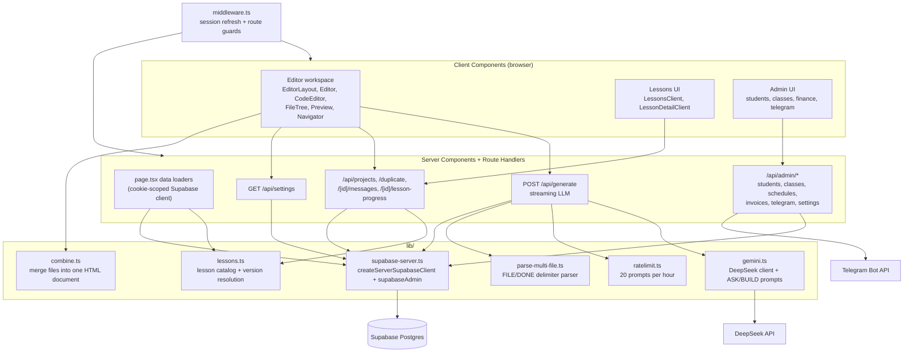
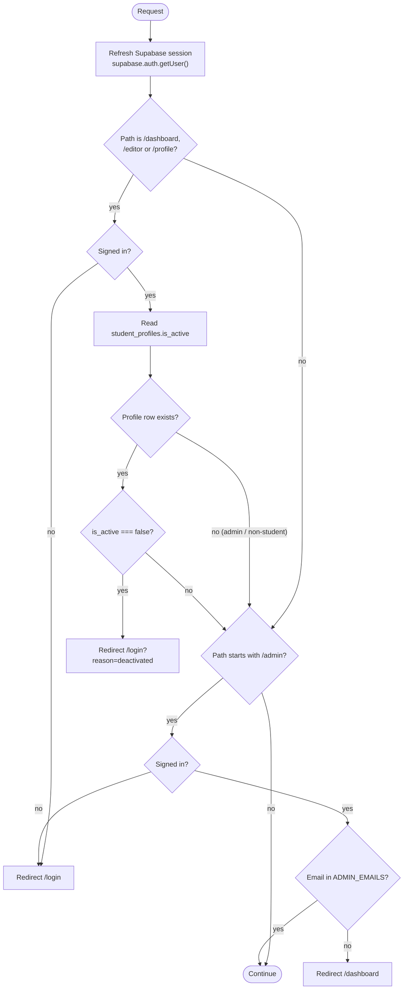
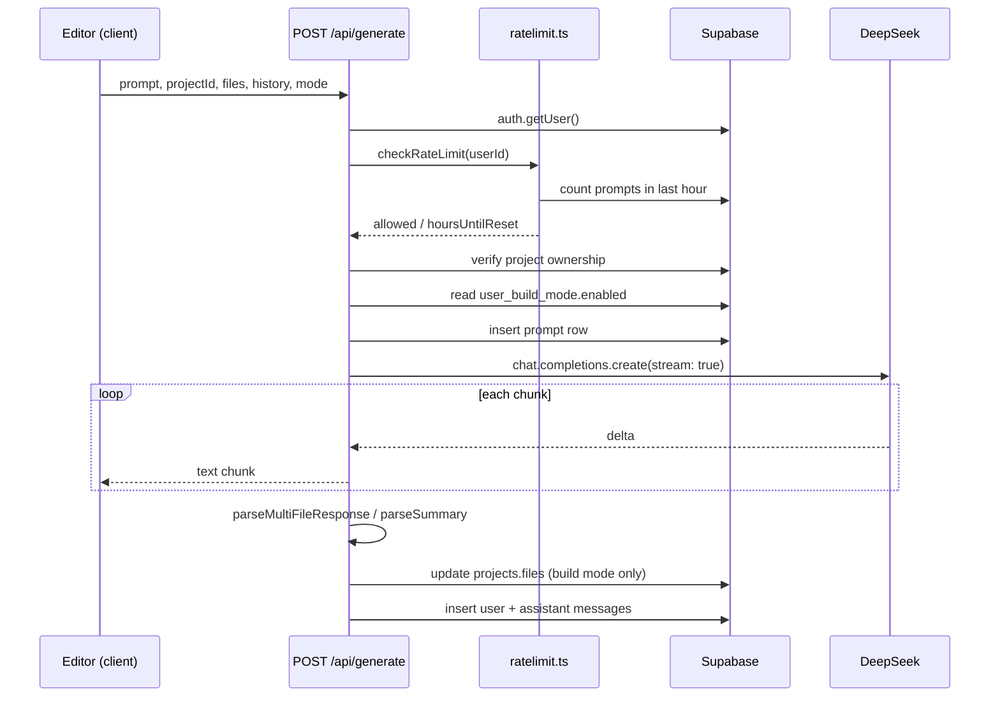

# Architecture

How the system is layered, where trust boundaries sit, and how a request flows end to end.

## System Layers



## Server / Client Split

Every route follows the same shape:

- `page.tsx` is a Server Component. It calls `createServerSupabaseClient()`, reads the session from cookies, fetches the data the page needs, and renders a colocated Client Component with that data as props.
- The `*Client.tsx` / `*Layout.tsx` file carries `'use client'` and owns all interaction state. It mutates data by calling API route handlers with `fetch`, never by talking to Postgres directly.

`app/editor/[id]/page.tsx` is the canonical example: it loads the project, its message history, the resolved lesson (if any), and existing lesson progress, then hands all of it to `EditorLayout`.

## The Three Supabase Clients

This is the most important boundary in the codebase to get right.

| Client | Defined in | Key used | Runs where | RLS |
| --- | --- | --- | --- | --- |
| `createBrowserSupabaseClient()` | `lib/supabase-browser.ts` | anon | Client Components | enforced |
| `createServerSupabaseClient()` | `lib/supabase-server.ts` | anon + request cookies | Server Components, route handlers | enforced |
| `supabaseAdmin` | `lib/supabase-server.ts` | service role | server only | **bypassed** |

Rules that follow from this:

- `createServerSupabaseClient()` is used to answer one question: *who is this request?* Its `setAll` is wrapped in `try/catch` because Server Components cannot set cookies — middleware handles refresh instead.
- `supabaseAdmin` performs the actual reads and writes. Because it bypasses RLS, **authorization must be expressed explicitly in every query**. The codebase does this by filtering on the caller's id inside the statement itself, for example `.eq('id', id).eq('user_id', user.id)` on update and delete, so a mismatched owner produces zero affected rows rather than a successful write.
- `supabaseAdmin` must never be imported into a Client Component. It is instantiated at module scope with the service-role key.
- The browser client is used only for auth actions (`signInWithOAuth`, `signOut`) and reading the current user.

## Middleware Pipeline

`middleware.ts` runs on every request except `_next/static`, `_next/image`, `favicon.ico`, `auth/callback`, and `share`. The last two exclusions are deliberate: the OAuth callback must work before a session exists, and share pages are public.



Two consequences worth internalizing:

- **A missing `student_profiles` row means "not a student" and is allowed through.** Only an explicit `is_active === false` blocks access. Adding a profile row for every user would change this behavior.
- **Middleware does not protect API routes' authorization, only page navigation.** Each admin route handler defines its own local `isAdmin(email)` helper and re-checks against `ADMIN_EMAILS`. If you add a new admin endpoint, you must add that check yourself.

## Generation Pipeline

`POST /api/generate` (`runtime = 'nodejs'`) is the most involved path in the system.

1. Authenticate via `createServerSupabaseClient()`; `401` if anonymous.
2. Check the rate limit with `checkRateLimit(user.id)`, skipped entirely when the caller's email is in `ADMIN_EMAILS`; `429` with an `hoursUntilReset` message when exceeded.
3. Parse `{ prompt, projectId, files, history, selectedCode, mode }`; `400` if `prompt` or `projectId` is missing.
4. Verify ownership with a single `supabaseAdmin` select filtered on both `id` and `user_id`; `404` if it does not match.
5. Resolve the effective mode. The client's requested `mode` is a hint only — build mode is granted only if `user_build_mode.enabled` is `true` for this user. Default is ask mode.
6. Insert the prompt into `prompts`. This table doubles as the rate-limit log, so the insert must happen before the LLM call for the limit to be meaningful.
7. Assemble the LLM messages: the selected system prompt, plus the current project files rendered with `1 | ` line-number prefixes (so the tutor can cite line numbers), plus the last 10 history turns, plus the user turn (prefixed with any selected code).
8. Stream DeepSeek chunks straight to the client through a `ReadableStream` with `Content-Type: text/event-stream`.
9. After the stream closes, inspect the accumulated text. If it starts with `--- FILE:`, parse it and replace `projects.files` wholesale, then store `parseSummary()`'s friendly sentence as the assistant message. Otherwise store the raw text.
10. Insert both the user and assistant rows into `messages`.



Design notes:

- **Rate limiting fails open.** If the counting query errors, `checkRateLimit` logs and allows the request. Availability was chosen over strict enforcement.
- **Full-file replacement, no diffs.** The model always returns complete files; there is no patch format to reconcile.
- **Persistence happens after streaming, inside the stream controller.** A client that disconnects mid-stream can still have its files and messages saved, since the work runs server-side.

## Preview Rendering

`components/Preview.tsx` renders `<iframe srcDoc={...} sandbox="allow-scripts allow-forms">`. No WebContainer, Sandpack, or CodeSandbox SDK is used, and none should be added — the point is zero external sandbox infrastructure.

Two behaviors are easy to miss:

- Before rendering, a console-interceptor `<script>` is injected right after `<head>`. It forwards `console.*` calls and `window.onerror` to the parent via `postMessage({ type: '__console__' })`, which `EditorLayout` listens for to populate its Console tab. It also shims `localStorage`/`sessionStorage`, which are unavailable in a sandboxed opaque-origin frame.
- Output that does not begin with a `<!DOCTYPE html>` declaration renders an "Invalid output" panel instead of the iframe.

`lib/combine.ts` merges a multi-file project into the single document the iframe receives: it strips external `<link rel="stylesheet">` and `<script src=...>` references (which cannot resolve inside `srcdoc`), then inlines `style.css` before `</head>` and `script.js` before `</body>`.

## Lesson Versioning

`lib/lessons.ts` holds two catalogs and a resolver. `CURRENT_LESSON_VERSION` selects between them:

```
getLessonForProject(lessonId, lessonVersion)
  → lessonVersion === CURRENT_LESSON_VERSION ? LESSONS : LEGACY_LESSONS
```

A project stores `lesson_id` and `lesson_version` at creation time, and `POST /api/projects` only writes `lesson_version` when the client's value equals `CURRENT_LESSON_VERSION`. Projects created before the current revision therefore keep resolving against the legacy catalog with their original task ids intact, which matters because `lesson_progress.completed_task_ids` stores those ids. Bumping the version means adding a new catalog rather than editing the old one.

Task-to-code linkage is by string search: each task carries a `commentAnchor`, and `Navigator` finds the line whose text contains that anchor to drive editor highlighting. Renaming an anchor comment in a template silently breaks highlighting for that task.

## Path Alias

`@/` maps to the repository root, configured identically in `tsconfig.json` (`paths`) and `jest.config.ts` (`moduleNameMapper`). Both must be kept in sync.

## Related Documents

- `components.md` — the concrete file inventory behind each layer.
- `interfaces.md` — request and response contracts for every endpoint.
- `data_models.md` — the tables these layers read and write.
- `workflows.md` — end-to-end user journeys across these layers.
