# Codebase Information

Basic facts about the repository: what it is, what it is built with, and where things live.

## What This Project Is

`student-code-builder` — a Next.js application used to teach web development to students (roughly ages 10–16). It has three distinct product surfaces sharing one codebase:

1. **AI-assisted code editor** — a student writes a prompt, an LLM responds either as a tutor (ask mode) or by generating a complete HTML file (build mode), and the result renders live in an iframe.
2. **Structured lesson track** — a catalog of weekly lessons, each backed by an HTML template with in-file task anchors and per-task progress tracking.
3. **Admin/teacher back office** — student accounts, classes with weekly schedules, and an invoice/receipt system with Telegram delivery to parents.

## Technology Stack

| Layer | Choice | Notes |
| --- | --- | --- |
| Framework | Next.js 14.2.5, App Router | Server Components by default; `next.config.js` is empty (no custom config) |
| Language | TypeScript 5, `strict: true` | `noEmit`, `moduleResolution: bundler`, `jsx: preserve` |
| Styling | Tailwind CSS 3.4 + `app/globals.css` | CSS-variable theme tokens (`surface-*`, `fg-*`, `brand-*`) |
| UI primitives | shadcn-style components in `components/ui/` | `components.json`: style `base-nova`, RSC enabled, `lucide` icon library |
| Auth + database | Supabase (`@supabase/ssr`, `@supabase/supabase-js`) | Google OAuth, Postgres with row-level security |
| LLM | DeepSeek (`deepseek-v4-flash`) via the `openai` SDK | OpenAI-compatible client pointed at `https://api.deepseek.com` |
| Code editing | CodeMirror via `@uiw/react-codemirror` | `@codemirror/lang-html`, `@codemirror/theme-one-dark` |
| Layout | `react-resizable-panels` | Editor split panes |
| Markdown | `react-markdown` + `remark-gfm` | Chat message rendering |
| Theming | `next-themes` | Light/dark/system via `ThemeProvider` |
| Messaging | Telegram Bot API (direct `fetch`) | Invoice and receipt delivery to parents |
| Testing | Jest 30 + Testing Library | `jest.config.ts` built through `next/jest` |

Full dependency-by-dependency rationale lives in `dependencies.md`.

## Language and File-Type Coverage

- **TypeScript / TSX** — all application code. Fully analyzed.
- **SQL** — `drizzle/*.sql`, the authoritative schema (applied via `bun run db:migrate`, authored through `lib/db/schema.ts`). Analyzed manually; see `data_models.md`.
- **Standalone HTML** — `public/templates/*.html` lesson starter files. These are student-facing content, not application code; they contain `<!-- TASK: ... -->` / `CHANGE THIS:` anchor comments that `lib/lessons.ts` references by string match. Not symbol-analyzed.
- **CSS** — `app/globals.css` defines the theme tokens used by every Tailwind class in the app. Not symbol-analyzed.

## Directory Organization

```mermaid
graph TB
    ROOT["repository root"]

    ROOT --> APP["app/<br/>routes, layouts, API handlers"]
    ROOT --> COMP["components/<br/>reusable UI"]
    ROOT --> LIB["lib/<br/>shared server + client utilities"]
    ROOT --> TYPES["types/<br/>shared TypeScript interfaces"]
    ROOT --> SUPA["drizzle/<br/>applied SQL schema migrations"]
    ROOT --> PUB["public/templates/<br/>lesson starter HTML"]
    ROOT --> TESTS["__tests__/<br/>unit + integration"]
    ROOT --> MW["middleware.ts<br/>session, route guards, admin gate"]

    APP --> API["api/<br/>route handlers"]
    APP --> EDITOR["editor/[id]/<br/>main workspace"]
    APP --> LESSONS["lessons/, lessons/[id]/"]
    APP --> ADMIN["admin/<br/>back office pages + tabs"]
    APP --> PUBPAGES["dashboard/, explore/, share/[id]/,<br/>invoice/[id]/, receipt/[id]/,<br/>profile/, login/, register/, about/"]
    APP --> AUTH["auth/callback/<br/>OAuth code exchange"]

    API --> APIGEN["generate/<br/>streaming LLM endpoint"]
    API --> APIPROJ["projects/<br/>CRUD, duplicate, messages, lesson-progress"]
    API --> APIADMIN["admin/<br/>students, classes, schedules, invoices, telegram, settings"]
    API --> APISET["settings/<br/>read own build-mode flag"]

    COMP --> COMPUI["ui/<br/>shadcn primitives"]
    COMP --> COMPADMIN["admin/<br/>modals and action buttons"]

    LIB --> LIBSB["supabase-browser.ts, supabase-server.ts"]
    LIB --> LIBAI["gemini.ts (DeepSeek client), parse-multi-file.ts"]
    LIB --> LIBDOMAIN["lessons.ts, ratelimit.ts, combine.ts, utils.ts"]
```

## Key Entry Points

| Concern | File |
| --- | --- |
| Root layout, theme provider | `app/layout.tsx` |
| Route protection, admin gate, deactivation check | `middleware.ts` |
| Main student workspace | `app/editor/[id]/page.tsx` → `app/editor/[id]/EditorLayout.tsx` |
| LLM request pipeline | `app/api/generate/route.ts` |
| Project CRUD | `app/api/projects/route.ts` |
| Lesson catalog and versioning | `lib/lessons.ts` |
| LLM client and system prompts | `lib/gemini.ts` (DeepSeek, despite the filename) |
| Supabase clients | `lib/supabase-server.ts`, `lib/supabase-browser.ts` |
| Admin shell | `app/admin/layout.tsx`, `app/admin/AdminSidebar.tsx` |
| Schema of record | `drizzle/` (authored via `lib/db/schema.ts`) |

## Configuration Files

| File | What it establishes |
| --- | --- |
| `tsconfig.json` | `strict: true`; `@/*` maps to the repository root |
| `jest.config.ts` | `testEnvironment: 'node'` globally; `@/` mapped to `<rootDir>`; `testMatch` `**/__tests__/**/*.test.{ts,tsx}`; setup via `jest.setup.ts` |
| `tailwind.config.ts` | Theme token scales consumed throughout the UI |
| `components.json` | shadcn generator config and import aliases |
| `postcss.config.js` | Tailwind + autoprefixer |
| `next.config.js` | Empty object — no custom Next.js configuration |
| `.env.local.example` | The complete required environment variable set |

Both `package-lock.json` and `bun.lock` are committed; see `review_notes.md` for the resulting ambiguity.

## Architectural Patterns Observed

- **Server Components fetch, Client Components interact.** Each route's `page.tsx` is a Server Component that loads data with the cookie-scoped Supabase client and passes it as props into a colocated `*Client.tsx` Client Component.
- **Colocation over centralization for route-specific UI.** `EditorLayout.tsx`, `ClassesClient.tsx`, `ForkButton.tsx` and similar live next to the route that uses them; only genuinely reusable UI goes in `components/`.
- **Writes go through API route handlers using the service-role client**, never directly from the browser.
- **Defense in depth on authorization.** `middleware.ts` gates page routes; every admin API handler independently re-checks admin status; ownership checks are expressed as `.eq('user_id', user.id)` filters inside the query rather than as separate read-then-write steps.
- **Delimiter-based LLM contract** instead of function calling or JSON mode, parsed by `lib/parse-multi-file.ts`.

See `architecture.md` for the reasoning behind these, and `components.md` for the concrete file inventory.
