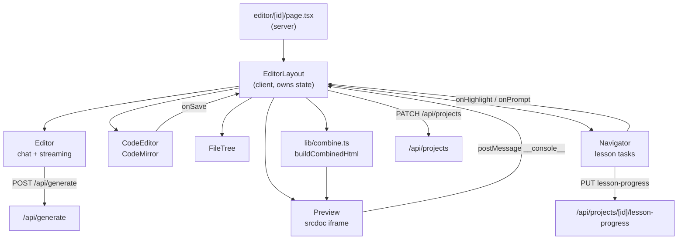

# Components

Where each piece of UI lives and what it owns. Use this to locate the file that implements a given feature.

## Colocation Convention

Reusable UI lives in `components/`. UI that only one route uses lives next to that route. This is applied consistently, so the presence of a `*Client.tsx` beside a `page.tsx` tells you the route is a server-fetch / client-interact pair.

```
app/editor/[id]/page.tsx          → Server Component: loads project, messages, lesson, progress
app/editor/[id]/EditorLayout.tsx  → Client Component: owns all workspace state
```

## Editor Subsystem

The largest and most stateful area of the app.

| File | Responsibility |
| --- | --- |
| `app/editor/[id]/page.tsx` | Loads the project, message history, resolved lesson, and completed task ids |
| `app/editor/[id]/EditorLayout.tsx` | Orchestrates everything: file map, open tabs, active file, messages, title, panel sizes, activity sidebar, console log buffer, highlighted line, pending prompt |
| `components/Editor.tsx` | Chat panel — prompt input, streaming response consumption, message list rendering |
| `components/CodeEditor.tsx` | CodeMirror instance, save-on-change, selection capture, line highlighting |
| `components/FileTree.tsx` | File list with inline add-file input and keyboard handling |
| `components/Preview.tsx` | Sandboxed `srcdoc` iframe with the console interceptor |
| `components/Navigator.tsx` | Lesson task list, progress bars, mark-done persistence, tutor help chips |

`components/Editor.tsx` fetches `GET /api/settings` on mount and stores the result as `buildModeAvailable`, which decides whether the ask/build switch is offered to the student. The toggle that actually grants the permission is an admin control (`components/BuildModeToggle.tsx`, rendered from `app/admin/tabs/OverviewTab.tsx`), not a student one.



State that lives in `EditorLayout` and is worth knowing about before changing it:

- `files` is the single source of truth for content; `openTabs` and `activeFile` are view state derived from it.
- `rightTab` switches between `code`, `preview`, and `console`; `splitView` shows code and preview together.
- `activity` selects the left sidebar panel (`explorer`, `chat`, or `navigator`) and defaults to `navigator` when the project belongs to a lesson.
- Sidebar resizing is done with manual mouse listeners and a ref-tracked width, and sets `previewBlocked` during the drag so the iframe does not swallow mouse events.
- `consoleLogs` is appended from a `window` `message` listener filtered on `type === '__console__'`.
- Messages are loaded from props and then immediately refetched from `/api/projects/[id]/messages` on mount.

Every file mutation (`handleCodeSave`, `handleAddFile`) writes the whole `files` object back through `PATCH /api/projects`.

## Lessons Subsystem

| File | Responsibility |
| --- | --- |
| `app/lessons/page.tsx` | Server: lists the catalog alongside the user's existing lesson projects |
| `app/lessons/LessonsClient.tsx` | Lesson cards, start/resume handling |
| `app/lessons/[id]/page.tsx` | Server: resolves one lesson and any existing project for it |
| `app/lessons/[id]/LessonDetailClient.tsx` | Task preview list; fetches the template HTML and creates the project |
| `components/Navigator.tsx` | In-editor task runner (see above) |
| `lib/lessons.ts` | Lesson catalogs, `CURRENT_LESSON_VERSION`, `getLessonForProject`, `legacyTask` |
| `public/templates/*.html` | Starter files with task anchor comments |

`LessonDetailClient.startLesson()` fetches `/templates/{lesson.templateFile}` as text from the public directory, then posts it to `/api/projects` as `templateHtml` together with `lessonId` and `lessonVersion`. If a project for that lesson already exists it navigates straight to the editor instead.

`Navigator` picks the active task with `firstUnfinishedTaskIndex`, which prefers the first incomplete `core` task and only then falls back to `choice`/`bonus`. Marking a task done updates local state optimistically, persists the full id array via `PUT`, and rolls back with an inline error if the request fails.

## Admin Subsystem

Page routes under `app/admin/`, each server-fetching and delegating to a colocated client:

| Route | Client component |
| --- | --- |
| `app/admin/page.tsx` | Renders the overview with a local `Skeleton` |
| `app/admin/students/page.tsx` | `StudentsClient.tsx` |
| `app/admin/students/[id]/page.tsx` | Server-rendered student detail (schedule, invoices, projects) |
| `app/admin/classes/page.tsx` | `ClassesClient.tsx` |
| `app/admin/classes/[id]/page.tsx` | `ClassDetailClient.tsx` |
| `app/admin/finance/page.tsx` | `FinanceClient.tsx` |
| `app/admin/telegram/page.tsx` | `TelegramClient.tsx` |

Shell and navigation: `app/admin/layout.tsx`, `app/admin/AdminSidebar.tsx`, `app/admin/AdminTabs.tsx`. Tab bodies in `app/admin/tabs/`: `OverviewTab.tsx` (includes an `estimateCost` helper), `StudentsTab.tsx`, `ClassesTab.tsx`, `FinanceTab.tsx`.

Action components in `components/admin/` — each is a small client component that calls one admin endpoint and refreshes:

| Component | Endpoint it drives |
| --- | --- |
| `CreateStudentModal.tsx` | `POST /api/admin/students` |
| `EditStudentModal.tsx` | `PATCH /api/admin/students/[id]` |
| `DeactivateToggle.tsx` | `PATCH /api/admin/students/[id]` (`is_active`) |
| `CreateClassInline.tsx` | `POST /api/admin/classes` |
| `ClassScheduleEditor.tsx` | `/api/admin/schedules` (add/edit/remove slots) |
| `AddToClassModal.tsx` | `POST /api/admin/classes/[id]/members` |
| `CreateInvoiceModal.tsx` | `POST /api/admin/invoices` |
| `EditInvoiceModal.tsx` | `PATCH /api/admin/invoices/[id]` |
| `DeleteInvoiceButton.tsx` | `DELETE /api/admin/invoices/[id]` |
| `SendInvoiceButton.tsx` | `POST /api/admin/invoices/[id]/send` |
| `MarkPaidButton.tsx` | `POST /api/admin/invoices/[id]/pay` |
| `BuildModeToggle.tsx` | `POST /api/admin/settings` (grants build mode per student) |

`ClassDetailClient.tsx` additionally defines inline sub-components (`AddStudentRow`, `AddSlotRow`, `SlotRow`) rather than extracting them to `components/admin/`.

Money is formatted at the point of display: several components define their own local `formatAmount` that divides cents by 100. There is no shared currency helper.

## Shared Shell and Primitives

| File | Responsibility |
| --- | --- |
| `app/layout.tsx` | Root layout, fonts, `ThemeProvider` |
| `components/ThemeProvider.tsx` | `next-themes` wrapper |
| `components/ThemeToggle.tsx` | Light/dark/system cycle with inline icon components |
| `components/Navbar.tsx` | Top navigation for non-editor pages |
| `components/Footer.tsx` | Site footer |
| `components/ProfileDropdown.tsx` | Account menu and sign-out via the browser Supabase client |
| `components/ui/button.tsx` | Button variants via `class-variance-authority` |
| `components/ui/dropdown-menu.tsx` | Dropdown primitive set |
| `lib/utils.ts` | `cn()` — `clsx` + `tailwind-merge` |

## Student-Facing and Public Pages

| Route | Notes |
| --- | --- |
| `app/page.tsx` | Landing page |
| `app/login/page.tsx` + `app/LoginForm.tsx` | Google OAuth sign-in button; `LoginForm` sits at `app/` root, not beside the route |
| `app/register/page.tsx` | Registration entry |
| `app/dashboard/page.tsx` + `DashboardClient.tsx` | Project list with copy-link, duplicate, toggle-public, delete, new-project actions |
| `app/explore/page.tsx` + `ExploreClient.tsx` | Public project gallery with a local `timeAgo` helper |
| `app/share/[id]/page.tsx` + `ForkButton.tsx` | Read-only public project view; fork calls `POST /api/projects/duplicate` |
| `app/profile/page.tsx` + `ProfileClient.tsx` | Profile editing |
| `app/invoice/[id]/page.tsx` + `PrintButton.tsx` | Printable invoice |
| `app/receipt/[id]/page.tsx` + `PrintButton.tsx` | Printable receipt (a separate `PrintButton` from the invoice one) |
| `app/about/page.tsx` | Static about page |

## Tests

`__tests__/unit/` mirrors the implementation tree (`unit/lib/`, `unit/components/`, `unit/app/lessons/`); `__tests__/integration/api/` covers route handlers (`projects`, `generate`, `lesson-progress`).

Component tests must open with a `/** @jest-environment jsdom */` docblock, because `jest.config.ts` sets `testEnvironment: 'node'` for the whole suite. Integration tests build chainable Supabase query mocks by hand (`makeAdminChain`, `progressWriteChain`, and similar) rather than using a shared fixture.

## Related Documents

- `architecture.md` — the layering these components sit in.
- `interfaces.md` — the endpoints these components call.
- `workflows.md` — how they compose into user journeys.
