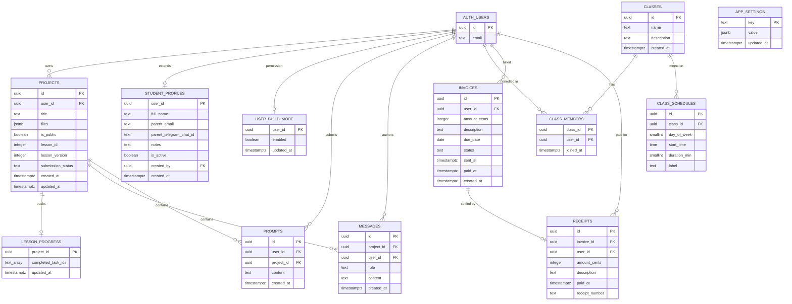

# Data Models

The Postgres schema, its TypeScript mirror, and the constraints that matter when changing either.

`supabase/migrations/*.sql` is the schema of record. `types/index.ts` is a hand-maintained mirror — there is no generated types file, so the two can drift.

## Entity Relationships

## Table-to-Type Mapping

| Table | TypeScript type in `types/index.ts` | Defining migration |
| --- | --- | --- |
| `projects` | `Project` (files as `ProjectFiles`) | initial schema; extended by `20260727_lesson_progress.sql`, `20260403_teacher_feedback.sql` |
| `prompts` | `Prompt` | initial schema |
| `messages` | `Message` | `20260307_messages.sql`, role constraint widened by `20260403_teacher_feedback.sql` |
| `app_settings` | *(none)* | `20260308_app_settings.sql` |
| `user_build_mode` | *(none)* | `20260309_user_build_mode.sql` |
| `student_profiles` | `StudentProfile` | `20260328_admin_schema.sql` |
| `classes` | `Class` | `20260328_admin_schema.sql` |
| `class_members` | `ClassMember` | `20260328_admin_schema.sql` |
| `class_schedules` | `ClassSchedule` | `20260328_admin_schema.sql` |
| `invoices` | `Invoice` | `20260328_admin_schema.sql` |
| `receipts` | `Receipt` | `20260328_admin_schema.sql` |
| `lesson_progress` | `LessonProgress` | `20260727_lesson_progress.sql` |

## Key Field Semantics

**`projects.files` (JSONB)** — a flat filename-to-contents map, typed as `ProjectFiles = Record<string, string>`. `index.html` is the entry point every consumer assumes. `lib/combine.ts` additionally recognizes `style.css` and `script.js` by exact name and inlines them; other filenames are stored and editable but will not be injected into the preview.

**`projects.lesson_id` / `lesson_version`** — both nullable; `null` means a free-form project. The pair is resolved by `getLessonForProject`, which reads the current catalog only when `lesson_version === CURRENT_LESSON_VERSION` and otherwise falls back to the legacy catalog. Old projects therefore keep their original task ids, which is required because `lesson_progress.completed_task_ids` stores those ids as plain strings with no foreign key.

**`projects.submission_status`** — added by `20260403_teacher_feedback.sql`, constrained to `submitted`, `approved`, or `needs_work`, with `null` meaning not submitted. Absent from the `Project` type.

**`lesson_progress.completed_task_ids`** — a `text[]` defaulting to `'{}'`. Written only via upsert on the `project_id` primary key, after the API validates every id against the resolved lesson's task list.

**`messages.role`** — originally constrained to `user` and `assistant`; the teacher-feedback migration widened it to also allow `teacher`. The `Message` type still narrows it to `'user' | 'assistant'`.

**`prompts`** — doubles as the rate-limit ledger. `lib/ratelimit.ts` counts rows for a user with `created_at` inside the last hour against `HOURLY_LIMIT = 20`. Deleting prompt rows effectively resets a user's quota, and `DELETE /api/projects` does exactly that for the deleted project.

**Money** — always integer cents. `invoices.amount_cents` carries a `check (amount_cents > 0)`. Formatting to currency happens in the UI and in `/api/admin/invoices/[id]/send`, each with its own local `formatAmount` dividing by 100.

**`invoices.status`** — `check (status in ('unpaid','paid','void'))`. `paid` is treated as terminal by the API: edits and deletes are refused, and only `unpaid` invoices can be paid.

**`receipts`** — an immutable snapshot. Amount and description are copied at payment time rather than joined, so later invoice edits cannot rewrite history. `receipt_number` is `unique` and formatted `RCP-<year>-<sequence padded to 4>` from `receipt_number_seq`.

**`class_schedules.day_of_week`** — `smallint` with `check (day_of_week between 0 and 6)`, where 0 is Sunday. `start_time` is a bare `time` (no timezone) and `duration_min` defaults to 60. There is no timezone column anywhere, so all scheduling is implicitly in the school's local time.

**`app_settings`** — a generic key/value store seeded with `build_mode_enabled = false`. The runtime build-mode decision is made per user from `user_build_mode`, not from this row.

## Row-Level Security Posture

| Table | RLS | Policies |
| --- | --- | --- |
| `messages` | enabled | `select` where `auth.uid() = user_id` |
| `lesson_progress` | enabled | **none defined** — unreachable except via the service-role client |
| `student_profiles` | enabled | permissive admin full access (`using (true)`), plus student `select` on own row |
| `classes`, `class_members`, `class_schedules`, `invoices`, `receipts` | enabled | permissive admin full access (`using (true)`) |

The "Admin full access" policies are unconditional `true` predicates. They do not identify an admin — they simply allow anything RLS is asked to evaluate. Effective authorization for these tables comes entirely from the fact that access is funneled through server routes that check `ADMIN_EMAILS`. Do not treat these policies as a security boundary, and do not expose these tables to the anon key.

## Cascade Behavior

`20260329_cascade_user_deletes.sql` rewrote `projects.user_id` and `prompts.user_id` to `on delete cascade`, so deleting an `auth.users` row removes the user's projects and prompts without manual ordering. Also cascading from `auth.users`: `student_profiles`, `user_build_mode`, `class_members`, `messages`, `invoices`. `lesson_progress` cascades from `projects`; `class_members` and `class_schedules` cascade from `classes`.

`receipts.invoice_id` and `receipts.user_id` have **no** cascade — receipts are intentionally hard to delete.

Despite the cascades, `DELETE /api/projects` still deletes `messages` and `prompts` rows explicitly before the project.

## Related Documents

- `interfaces.md` — which endpoint writes each field.
- `architecture.md` — why RLS is bypassed on the write path.
- `review_notes.md` — the specific drift between `types/index.ts` and the migrations.
