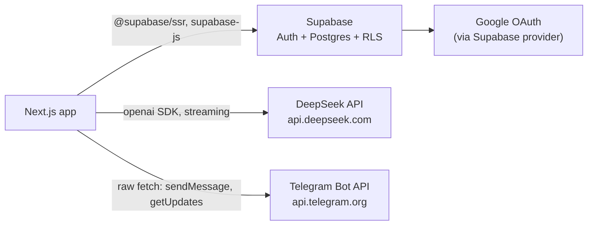

# Dependencies

External packages, external services, and the environment variables that bind them.

## Runtime Dependencies

| Package | Used for | Where |
| --- | --- | --- |
| `next` | Framework: App Router, route handlers, middleware | everywhere |
| `react`, `react-dom` | UI runtime | everywhere |
| `@supabase/ssr` | Cookie-aware Supabase clients | `lib/supabase-server.ts`, `lib/supabase-browser.ts`, `middleware.ts`, `app/auth/callback/route.ts` |
| `@supabase/supabase-js` | Base client for the service-role admin instance | `lib/supabase-server.ts` (`supabaseAdmin`) |
| `openai` | OpenAI-compatible client pointed at DeepSeek | `lib/gemini.ts` |
| `@uiw/react-codemirror` | Code editor component | `components/CodeEditor.tsx` |
| `@codemirror/lang-html` | HTML syntax support | `components/CodeEditor.tsx` |
| `@codemirror/theme-one-dark` | Editor dark theme | `components/CodeEditor.tsx` |
| `react-resizable-panels` | Editor split panes (imported as `Group`, `Panel`, `Separator`) | `app/editor/[id]/EditorLayout.tsx` |
| `react-markdown` + `remark-gfm` | Rendering assistant chat messages | `components/Editor.tsx` |
| `next-themes` | Light/dark/system theming | `components/ThemeProvider.tsx`, `components/ThemeToggle.tsx` |
| `tailwindcss` | Styling system | all components |
| `clsx` + `tailwind-merge` | Class composition behind `cn()` | `lib/utils.ts` |
| `class-variance-authority` | Variant-based component styling | `components/ui/button.tsx` |
| `lucide-react` | Icon set (configured as the shadcn icon library) | UI components |
| `@base-ui/react` | Headless primitives underpinning `components/ui/` | `components/ui/` |
| `shadcn` | Component generator CLI, configured by `components.json` | development only |
| `tw-animate-css` | Animation utility classes | styling |

Notable absences, all deliberate: no state-management library (component state and props only), no data-fetching library (`fetch` directly), no form library, no ORM (the Supabase query builder is used directly), and no browser sandbox package.

## Development Dependencies

| Package | Used for |
| --- | --- |
| `typescript`, `@types/*` | Type checking |
| `jest`, `jest-environment-jsdom` | Test runner; jsdom is opted into per file |
| `@testing-library/react`, `@testing-library/jest-dom`, `@testing-library/user-event` | Component testing |
| `eslint`, `eslint-config-next` | Linting; no custom rule overrides in the repo |
| `postcss`, `autoprefixer` | Tailwind build pipeline |

## External Services

| Service | Integration point | Failure behavior |
| --- | --- | --- |
| Supabase Auth | `signInWithOAuth`, `exchangeCodeForSession`, `auth.admin.createUser` | Callback failure redirects to `/?error=auth_failed` |
| Supabase Postgres | All reads and writes | Most handlers surface the Postgres message with `500` |
| DeepSeek | `deepseek.chat.completions.create({ stream: true })` in `/api/generate` | Stream errors are logged and the controller errors out |
| Telegram Bot API | `fetch` to `sendMessage` and `getUpdates` | Missing token returns `500`; an `ok: false` response returns `500` with Telegram's description |

The model identifier is pinned as a constant (`MODEL = "deepseek-v4-flash"` in `lib/gemini.ts`). Cost control is the stated reason the model choice is fixed, alongside the per-user hourly prompt cap in `lib/ratelimit.ts`.

## Environment Variables

From `.env.local.example`:

| Variable | Exposure | Used by |
| --- | --- | --- |
| `NEXT_PUBLIC_SUPABASE_URL` | browser + server | all three Supabase clients, middleware, auth callback |
| `NEXT_PUBLIC_SUPABASE_ANON_KEY` | browser + server | browser and cookie-scoped server clients |
| `SUPABASE_SERVICE_ROLE_KEY` | **server only** | `supabaseAdmin` in `lib/supabase-server.ts` |
| `DEEPSEEK_API_KEY` | **server only** | `lib/gemini.ts` |
| `ADMIN_EMAILS` | **server only** | `middleware.ts` admin gate, every admin route's `isAdmin`, rate-limit bypass in `/api/generate` |
| `TELEGRAM_BOT_TOKEN` | **server only** | invoice send, telegram updates |
| `NEXT_PUBLIC_SITE_URL` | browser + server | absolute invoice and receipt links in Telegram messages |

Rules:

- Anything without the `NEXT_PUBLIC_` prefix must never be referenced from a file carrying `'use client'`, since Next.js inlines referenced values into the client bundle.
- `ADMIN_EMAILS` is a comma-separated list, trimmed and lowercased at every comparison site. It is authorization configuration, not a feature flag: adding an address grants back-office access and an unlimited prompt quota.
- `NEXT_PUBLIC_SITE_URL` defaults to an empty string when unset, which silently produces relative links inside Telegram messages.
- `.env.local` is present locally and must stay uncommitted.

## Package Manager

Both `package-lock.json` and `bun.lock` are committed, and the two in-repo guidance documents disagree about which to use. See `review_notes.md`.

## Related Documents

- `interfaces.md` — how each external service is called.
- `architecture.md` — the trust boundary between the anon and service-role keys.
