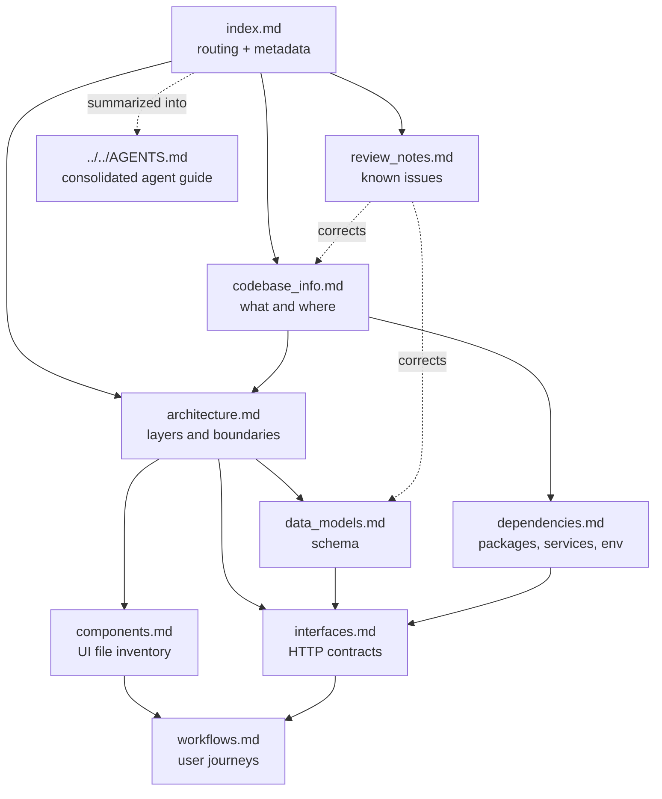

# Documentation Knowledge Base Index

Generated documentation for `student-code-builder`, a Next.js 14 App Router application combining an AI-assisted code editor, a structured lesson track, and a teacher/admin back office.

## How AI Assistants Should Use This Index

1. **Start here, not with the codebase.** This file alone is enough to route almost any question to the right document. Load the specific document only once you know which one you need.
2. **Match the question to a document using the routing table below**, then read that document in full — each is written to be self-contained for its topic.
3. **Treat `drizzle/` (via `lib/db/schema.ts`) and `types/index.ts` as authoritative over prose** when they conflict, and note the drift between them recorded in `review_notes.md`.
4. **Read `review_notes.md` before making changes.** It documents known conflicts, currently failing tests, and security observations that will otherwise look like new problems you introduced.
5. **Read the actual file before editing it.** These documents tell you where behavior lives and why; they are not a substitute for the code at the moment of modification.
6. **Do not trust `CLAUDE.md`'s scope constraints.** They describe an earlier MVP; the discrepancies are itemized in `review_notes.md`.

## Question Routing

| If the question is about... | Read |
| --- | --- |
| What this project is, what it's built with, where a directory lives | `codebase_info.md` |
| Which Supabase client to use, server vs client boundaries, request flow, trust boundaries | `architecture.md` |
| "Where is the code that does X?", which component owns a piece of UI | `components.md` |
| Endpoint request/response shapes, status codes, auth requirements, the LLM output format | `interfaces.md` |
| Tables, columns, constraints, RLS, cascades, type-to-table mapping | `data_models.md` |
| How a user journey works end to end, invoice lifecycle, lesson progression | `workflows.md` |
| Why a package is here, external services, environment variables | `dependencies.md` |
| Known bugs, stale docs, failing tests, security concerns, documentation gaps | `review_notes.md` |
| Day-to-day conventions, style rules, commit format | root `AGENTS.md` |

## Document Catalog

### `codebase_info.md`
**Purpose:** Orientation. **Contains:** what the product is (three surfaces: editor, lessons, admin), the full technology stack table, file-type coverage including what was not symbol-analyzed, a Mermaid directory hierarchy, a key-entry-point table, the configuration-file inventory, and the five recurring architectural patterns. **Read when:** you are new to the repository or need to locate a subsystem by name.

### `architecture.md`
**Purpose:** How the system is layered and where trust boundaries sit. **Contains:** a layered Mermaid system diagram; the server-fetch / client-interact page convention; the three-Supabase-client table with the rules that follow from it; a Mermaid flowchart of the middleware decision path including the deactivation check; the ten-step generation pipeline with a sequence diagram; the srcdoc preview decision including the injected console interceptor; the lesson versioning scheme; the `@/` alias. **Read when:** adding an endpoint, changing auth, touching the LLM path, or deciding which database client to use.

### `components.md`
**Purpose:** File-level navigation for UI work. **Contains:** the colocation convention; the editor subsystem table plus a Mermaid component-relationship diagram and a list of the state `EditorLayout` owns; the lessons subsystem; the admin subsystem including a component-to-endpoint mapping table; shared shell and `components/ui` primitives; public and student-facing pages; test layout including the jsdom docblock requirement. **Read when:** you need the file that implements a feature, or you are adding UI and want to know what already exists.

### `interfaces.md`
**Purpose:** The complete HTTP contract. **Contains:** conventions shared by all handlers; `POST /api/generate` in detail with a sequence diagram; the `/api/projects` method table with the unscoped-child-delete caveat; duplicate, messages, lesson-progress, and settings endpoints; every admin endpoint in one table; the invoice send and pay flows with a sequence diagram; the auth callback; the `--- FILE:` / `--- DONE ---` LLM contract and its parser; the preview `postMessage` channel. **Read when:** calling, changing, or testing any endpoint.

### `data_models.md`
**Purpose:** The schema and its TypeScript mirror. **Contains:** a full Mermaid entity-relationship diagram; a table-to-type-to-migration mapping; field semantics for the JSONB files map, lesson versioning, submission status, message roles, the prompts-as-rate-limit-ledger design, cents-based money, invoice status transitions, receipt immutability, and the day-of-week convention; the RLS posture table with a warning about the permissive admin policies; cascade behavior. **Read when:** writing a migration, adding a column, or reasoning about what a query can return.

### `workflows.md`
**Purpose:** End-to-end processes. **Contains:** sign-in and access gating with a sequence diagram; the free-form project lifecycle; the ask-vs-build generation decision as a flowchart; the lesson journey from catalog to task completion; admin student/class/schedule management; the invoice lifecycle as a state diagram; the procedure for adding a schema change. **Read when:** implementing or debugging a multi-step feature, or you need to know what the user sees.

### `dependencies.md`
**Purpose:** Why each external thing is here. **Contains:** runtime and dev dependency tables with the specific files that use each; deliberate absences (no state library, no ORM, no browser sandbox); an external-services diagram with failure behavior; the environment variable table marking server-only versus `NEXT_PUBLIC_*` and the rules that follow; the package-manager ambiguity. **Read when:** adding a dependency, configuring an environment, or debugging an integration.

### `review_notes.md`
**Purpose:** Everything known to be wrong or unfinished. **Contains:** seven consistency findings (documentation conflicts, broken npm scripts verified by running them, tests encoding stale constants, type drift behind migrations, the `lib/gemini.ts` misnomer, duplicated `isAdmin` and `formatAmount`); completeness gaps with suggested fixes; six security observations; a prioritized recommendation list. **Read when:** starting any change, and especially before concluding that something you observed is a new bug.

## Document Relationships

Reading orders that work well:

- **New to the repo:** `codebase_info.md` → `architecture.md` → `components.md`
- **Adding an endpoint:** `interfaces.md` → `data_models.md` → `architecture.md` (client and auth rules)
- **Changing the schema:** `data_models.md` → `workflows.md` (the migration procedure) → `review_notes.md` (existing type drift)
- **UI work:** `components.md` → `workflows.md`
- **Any change at all:** skim `review_notes.md` first

## Example Queries This Index Resolves

- *"Which Supabase client should a new API route use, and why does it need an explicit ownership filter?"* → `architecture.md`, three-clients section.
- *"What exactly does the LLM have to return for the editor to save files?"* → `interfaces.md`, LLM output contract; `architecture.md`, generation pipeline.
- *"Can a student turn on build mode themselves?"* → `workflows.md`, generation flowchart; the flag lives in `user_build_mode` and only an admin endpoint writes it.
- *"Why does `npm test` fail on a clean checkout?"* → `review_notes.md`, findings 3 and 4, with the specific stale expectations listed.
- *"I need to add a column to `projects` — what else has to change?"* → `workflows.md`, adding-a-schema-change procedure; `data_models.md` for the current shape.
- *"Where is the code that highlights the line for a lesson task?"* → `components.md`, `Navigator` entry; matching is by `commentAnchor` string search.

## Maintenance

These documents describe structure and intent, which change more slowly than code. Regenerate after adding a subsystem, changing the auth or LLM pipeline, or landing a migration. Deliberately excluded so the documents do not go stale on every commit: line counts, file sizes, exhaustive file listings, and standard framework commands.

Repository-specific conventions belong in the `Custom Instructions` section of the root `AGENTS.md`, which is preserved verbatim across regenerations.
