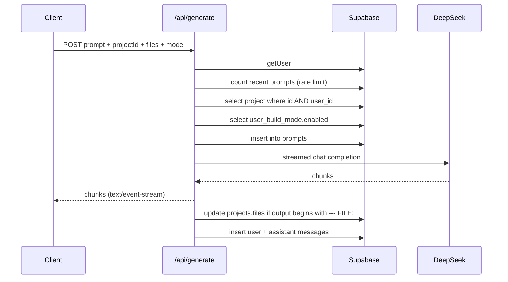
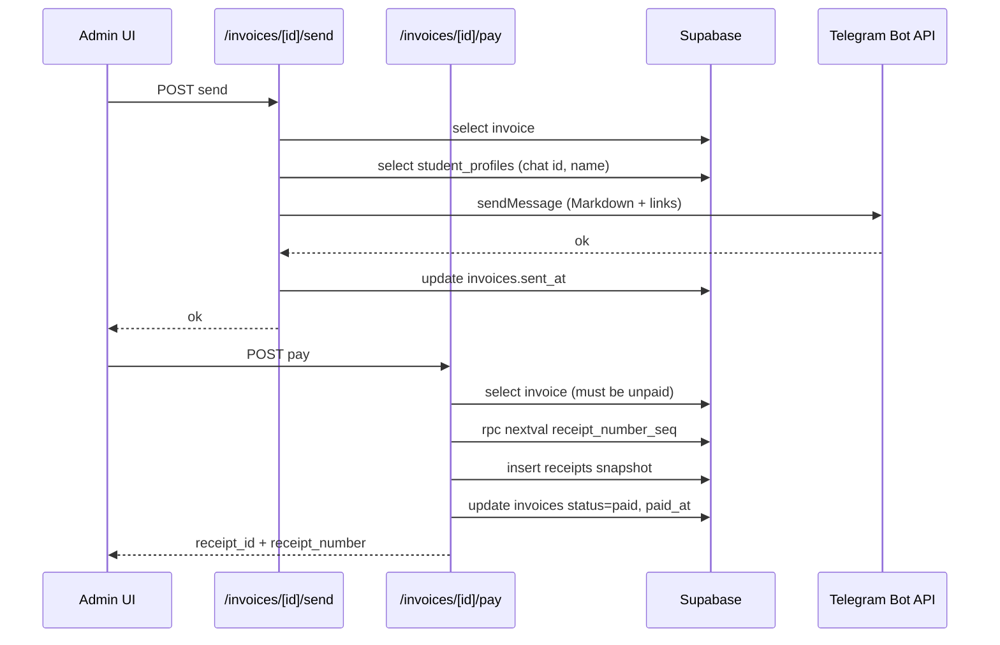

# Interfaces

Every HTTP surface in the application, plus the two internal contracts (LLM output format, Telegram messaging) that behave like interfaces.

## Conventions Across All Handlers

- Handlers live in `route.ts` files under `app/api/` and export functions named after the HTTP method.
- Authentication is always `createServerSupabaseClient()` + `auth.getUser()`, returning `{ "error": "Unauthorized" }` with `401` when absent.
- Admin endpoints additionally call a locally defined `isAdmin(email)` that splits `ADMIN_EMAILS` on commas and compares lowercased, returning `{ "error": "Forbidden" }` with `403`. **This helper is duplicated in each admin route file, not imported from a shared module.**
- Ownership on student-facing writes is enforced inside the query (`.eq('id', id).eq('user_id', user.id)`), so a foreign id yields `404` rather than a silent cross-tenant write.
- Errors are returned as `{ "error": string }`. Successful mutations without a body return `{ "ok": true }`.

## Student-Facing Endpoints

### `POST /api/generate`

Streaming LLM endpoint. `runtime = 'nodejs'`.

Request body:

```json
{
  "prompt": "string (required)",
  "projectId": "uuid (required)",
  "files": { "index.html": "..." },
  "history": [{ "role": "user | assistant", "content": "..." }],
  "selectedCode": "string",
  "mode": "ask | build"
}
```

Response: a raw text stream with `Content-Type: text/event-stream`, `Cache-Control: no-cache`, `Connection: keep-alive`. The body is plain model text, not SSE `data:` frames — consumers read it as a byte stream.

| Status | Condition |
| --- | --- |
| 200 | Stream opened |
| 400 | `prompt` or `projectId` missing |
| 401 | Not signed in |
| 404 | Project does not exist or is not owned by the caller |
| 429 | Rate limit exceeded; message includes hours until reset |

Behavior notes: `mode: 'build'` is only honored when `user_build_mode.enabled` is true for the caller. Admins bypass the rate limit. Only the last 10 `history` entries are forwarded. `files` are injected into the system prompt with `N | ` line-number prefixes.



### `/api/projects`

| Method | Purpose | Body / params | Success | Errors |
| --- | --- | --- | --- | --- |
| `GET` | List the caller's projects, newest updated first | — | `200` array of projects | `401`, `500` |
| `POST` | Create a project | `{ title?, templateHtml?, lessonId?, lessonVersion? }` | `201` project | `401`, `500` |
| `PATCH` | Update a project | `{ id (required), title?, is_public?, files? }` | `200` project | `400` missing id, `401`, `404` |
| `DELETE` | Delete a project | `?id=<uuid>` | `200` `{ success: true }` | `400`, `401`, `500` |

`POST` details: when `title` is omitted a random name is generated from fixed adjective and noun lists. When `templateHtml` is provided it becomes `files['index.html']`; otherwise a built-in animated starter document is inserted. `lesson_version` is written **only** if the submitted `lessonVersion` equals `CURRENT_LESSON_VERSION`.

`DELETE` details: rows in `messages` and `prompts` for the project are removed first to avoid foreign-key violations, and those deletes are not scoped by `user_id` — only the final project delete is. Passing another user's project id therefore still clears its child rows.

### `POST /api/projects/duplicate`

Body `{ id }`. Copies `title` (prefixed `Copy of `), `files`, and forces `is_public: false` under the caller's user id. Allowed when the caller owns the source **or** the source is public — this is the fork path for `/share/[id]`. Errors: `400` missing id, `401`, `403` private and not owned, `404` not found, `500`.

### `GET /api/projects/[id]/messages`

Returns `{ messages: Message[] }` ordered oldest-first, capped at 100. Ownership is checked by reading `projects.user_id` and comparing in application code. Errors: `401`, `404`.

### `/api/projects/[id]/lesson-progress`

Both methods first resolve the project through the private `getLessonProject` helper, which requires the project to be owned by the caller **and** to have a non-null `lesson_id` that resolves to a lesson via `getLessonForProject`. A non-lesson project returns `404 Lesson project not found`.

| Method | Body | Response |
| --- | --- | --- |
| `GET` | — | `{ completedTaskIds: string[] }` (empty array when no row exists) |
| `PUT` | `{ completedTaskIds: string[] }` | `{ completedTaskIds: string[] }` |

`PUT` validates that the payload is an array of strings, deduplicates it, and rejects any id that is not a task in the resolved lesson with `400`. It then upserts `lesson_progress` keyed on `project_id`. Errors: `400`, `401`, `404`, `500`.

### `GET /api/settings`

Returns `{ buildModeEnabled: boolean }` for the current user. Deliberately non-failing: anonymous callers and query errors both return `{ buildModeEnabled: false }` with `200`. Consumed by `components/Editor.tsx`.

## Admin Endpoints

All require a signed-in user whose email is in `ADMIN_EMAILS` (`401` / `403` otherwise).

| Endpoint | Method | Body / params | Notes |
| --- | --- | --- | --- |
| `/api/admin/settings` | `POST` | `{ userId, buildModeEnabled }` | Upserts `user_build_mode`; `400` if `userId` missing |
| `/api/admin/students` | `POST` | `{ email, full_name, parent_email?, parent_telegram_chat_id?, notes? }` | Creates the auth user via `supabaseAdmin.auth.admin.createUser` with `email_confirm: true` and no password, then inserts `student_profiles`. Returns `{ userId }`. `400` on missing fields or auth-create failure |
| `/api/admin/students/[id]` | `PATCH` | Partial `{ is_active, full_name, parent_email, parent_telegram_chat_id, notes }` | Updates `student_profiles` by `user_id`. Fields are not whitelisted — the parsed body is passed through to `update()` |
| `/api/admin/classes` | `GET` | — | All classes, newest first |
| `/api/admin/classes` | `POST` | `{ name, description? }` | `400` if `name` missing |
| `/api/admin/classes/[id]` | `PATCH` | Partial `{ name, description }` | |
| `/api/admin/classes/[id]` | `DELETE` | — | Cascades to `class_members` and `class_schedules` via FK |
| `/api/admin/classes/[id]/members` | `POST` | `{ userId }` | Postgres error `23505` (unique violation, already enrolled) is swallowed and treated as success |
| `/api/admin/classes/[id]/members` | `DELETE` | `?userId=<uuid>` | |
| `/api/admin/schedules` | `POST` | `{ class_id, day_of_week, start_time, duration_min?, label? }` | `duration_min` defaults to 60. `400` if `class_id`, `day_of_week`, or `start_time` missing |
| `/api/admin/schedules` | `PATCH` | `?id=<uuid>` + partial slot fields | |
| `/api/admin/schedules` | `DELETE` | `?id=<uuid>` | |
| `/api/admin/invoices` | `GET` | `?userId=<uuid>` optional filter | Newest first |
| `/api/admin/invoices` | `POST` | `{ user_id, amount_cents, description, due_date }` | All four required |
| `/api/admin/invoices/[id]` | `PATCH` | Partial `{ amount_cents, description, due_date, status }` | `400` if the invoice is already `paid` |
| `/api/admin/invoices/[id]` | `DELETE` | — | `400` if the invoice is already `paid` |
| `/api/admin/invoices/[id]/send` | `POST` | — | Sends a Telegram message; see below |
| `/api/admin/invoices/[id]/pay` | `POST` | — | Creates a receipt and marks the invoice paid; see below |
| `/api/admin/telegram/updates` | `GET` | — | Proxies `getUpdates` (limit 50) and returns deduplicated `{ chat_id, name, username }` so an admin can discover a parent's chat id after they message the bot |

### `POST /api/admin/invoices/[id]/send`

Requires `TELEGRAM_BOT_TOKEN` (`500` if unset). Loads the invoice, then the student's `student_profiles` row for `full_name` and `parent_telegram_chat_id`; `400` if no chat id is on file. Composes a Markdown message with the formatted amount, description, status line, an invoice link, and — when the invoice is already paid and a receipt exists — a receipt link. Links are built from `NEXT_PUBLIC_SITE_URL`. On a successful send it stamps `invoices.sent_at`. A Telegram `ok: false` response surfaces as `500` with Telegram's own description.

### `POST /api/admin/invoices/[id]/pay`

Refuses anything not currently `unpaid` (`400 Invoice is already <status>`). Generates a receipt number of the form `RCP-<year>-<4-digit sequence>` by calling `supabaseAdmin.rpc('nextval', { seq: 'receipt_number_seq' })`, **falling back to `Date.now()` if that RPC is unavailable**, which produces a much longer number. Inserts the immutable `receipts` snapshot first, then sets `invoices.status = 'paid'` and `paid_at`. Returns `{ receipt_id, receipt_number }`.

Because the receipt insert and the invoice update are two separate statements with no transaction, a failure between them leaves a receipt attached to an invoice still marked unpaid.



## Auth Callback

`GET /auth/callback` (`app/auth/callback/route.ts`) reads `code` and an optional `next` (default `/dashboard`), exchanges the code for a session with `exchangeCodeForSession`, and redirects. Any failure redirects to `/?error=auth_failed`. This route is excluded from the middleware matcher because it must run without an existing session.

## Internal Contract: LLM Output Format

Build mode responses must match this exactly, per `BUILD_SYSTEM_PROMPT`:

```
--- FILE: index.html ---
<!DOCTYPE html>
...complete file contents...
--- DONE ---
One sentence: what changed. One sentence: one thing to try next.
```

Parsing lives in `lib/parse-multi-file.ts`:

- `parseMultiFileResponse(text)` returns `null` unless the text contains `--- FILE:`. It truncates at `--- DONE ---`, splits on the file-header regex, and returns a `Record<filename, contents>`. The regex is anchored per-line and multiple headers are supported, so multi-file responses parse correctly even though the current prompt asks for one file.
- `parseSummary(text)` returns the trimmed text after `--- DONE ---`, or `null`.

`/api/generate` classifies a response as code with `accumulated.trimStart().startsWith('--- FILE:')`. Anything else is treated as chat and stored verbatim. When code is detected but parsing yields nothing, files are left untouched and a fallback sentence is stored as the assistant message.

Changing these delimiters requires updating the prompt in `lib/gemini.ts`, the parser, and the classification check in `/api/generate` together.

## Internal Contract: Preview Message Channel

`components/Preview.tsx` injects a script into the iframe that posts `{ type: '__console__', level, args }` to `window.parent`. `EditorLayout` listens on `window` `message`, filters on that exact `type`, and appends to its console buffer. The `postMessage` target origin is `'*'` and the listener does not verify `event.origin` — acceptable only because the frame content is the user's own project, and worth revisiting if the iframe ever loads third-party content.

## Related Documents

- `data_models.md` — the tables and constraints these endpoints operate on.
- `workflows.md` — the sequences that string these calls together.
- `architecture.md` — the client and authorization model behind them.
