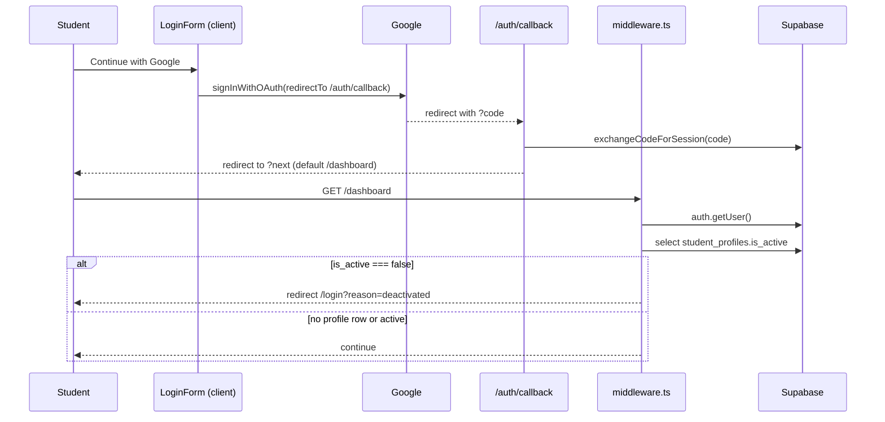
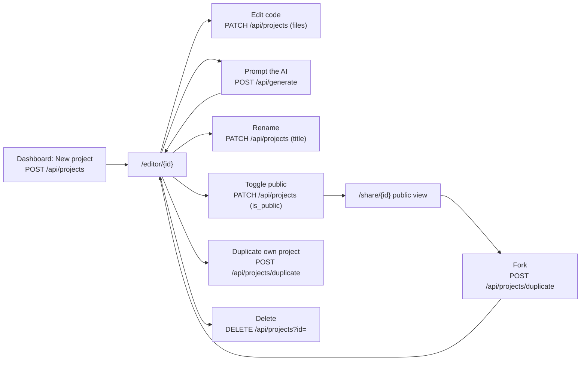
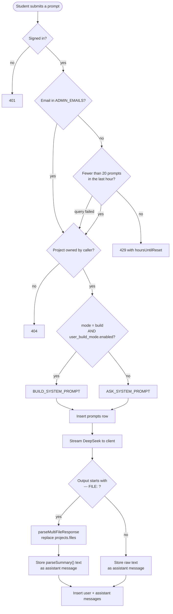
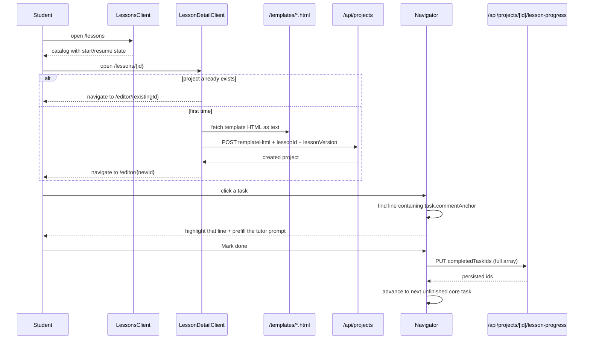
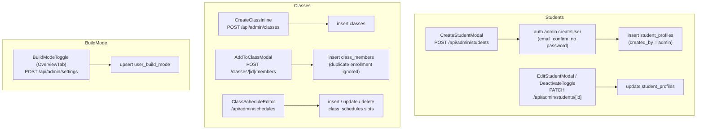
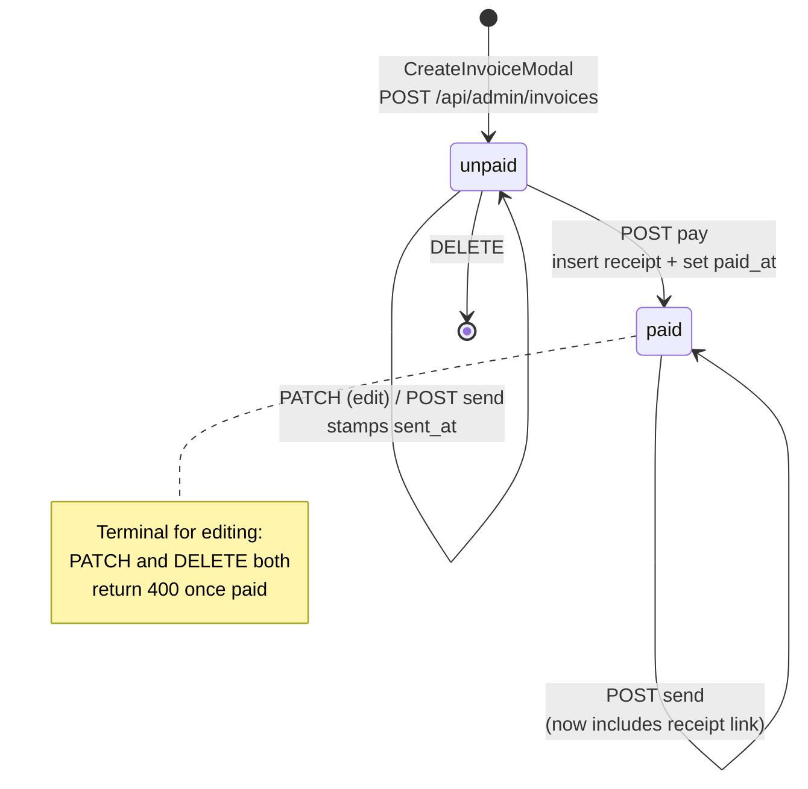

# Workflows

End-to-end processes, each traced through the actual files that implement it.

## Sign-In and Access Gating

`app/LoginForm.tsx` only offers Google OAuth. Admin-created students are provisioned server-side with `email_confirm: true` and no password, so they sign in through the same OAuth flow using the email the admin registered.

Deactivation is a soft block: `student_profiles.is_active = false` (set by `DeactivateToggle` through `PATCH /api/admin/students/[id]`) causes middleware to bounce the user out of `/dashboard`, `/editor`, and `/profile` on the next navigation. The auth user and all their data remain intact.

## Free-Form Project Lifecycle

Creating without a template inserts a built-in animated starter document as `index.html`. Duplicating always produces a private copy titled `Copy of <original>`. Deleting removes the project's `messages` and `prompts` rows first, then the project.

Saving is explicit rather than autosaved: `CodeEditor` changes flow up to `EditorLayout.handleCodeSave`, which writes the entire `files` map back with `PATCH /api/projects`. Adding a file does the same immediately with an empty string as contents.

## AI Generation (Ask vs Build)

The two modes are behaviorally very different and both are enforced by prompt, not by code:

- **Ask mode** (default) — the tutor persona never writes code, replies in at most three sentences, cites a specific line in bold, and ends with a question under ten words.
- **Build mode** (per-user permission) — returns a complete single HTML file in the delimiter format, preserves any `<!-- TASK N -->` comments already in the student's code, and edits only what was asked.

Because ask mode is the default and build mode requires a database flag an admin sets, a student cannot escalate to code generation by editing the request payload.

## Lesson Journey

Details that shape the experience:

- Opening a lesson project puts the editor sidebar in `navigator` mode automatically.
- Task ordering is not strictly sequential: `firstUnfinishedTaskIndex` prioritizes incomplete `core` tasks, then falls back to `choice` and `bonus`.
- `PUT` sends the complete id array, not a delta, and the server revalidates every id against the lesson.
- Progress is optimistic with rollback: a failed save restores the previous set and shows "Your task was not saved."
- Highlighting depends on the template's anchor comment text still matching `task.commentAnchor`.

## Admin: Student, Class, and Schedule Management

Telegram chat ids are discovered rather than typed from memory: a parent messages the bot, then the admin opens `/admin/telegram`, which calls `GET /api/admin/telegram/updates` to list recent `chat_id` values with names, and the admin copies the right one into the student's profile.

## Invoice Lifecycle

Full sequence:

1. An admin creates the invoice with `user_id`, `amount_cents`, `description`, and `due_date`. It starts `unpaid` with `sent_at` and `paid_at` null.
2. Sending pushes a Markdown message to the parent's Telegram chat containing the amount, description, status, and a link to `/invoice/{id}` built from `NEXT_PUBLIC_SITE_URL`, then stamps `sent_at`. Sending requires a `parent_telegram_chat_id` on the student's profile.
3. Marking paid allocates a receipt number from `receipt_number_seq`, inserts the immutable `receipts` snapshot, then flips the invoice to `paid` with a `paid_at` timestamp.
4. A later send on a paid invoice includes an additional link to `/receipt/{id}`.
5. `/invoice/[id]` and `/receipt/[id]` are print-oriented pages with a `PrintButton`; the receipt page is the parent-facing proof of payment.

Both `/invoice/[id]` and `/receipt/[id]` sit outside the middleware's protected prefixes, so anyone holding the id can view them. Treat those ids as the only access control on those pages.

## Adding a Schema Change

The repeatable procedure this repo implies:

1. Edit `lib/db/schema.ts` first, run `bun run db:generate` to derive DDL into `drizzle/`, hand-add whatever the DSL can't express (RLS, grants, functions, backfills), then `bun run db:migrate` to apply it — see `drizzle/README.md`. (`supabase/migrations/` no longer exists; `drizzle/` is the applied migration history.)
2. Update the matching interface in `types/index.ts` by hand — nothing generates it.
3. Update the route handlers that read or write the column; remember that `supabaseAdmin` bypasses RLS, so any new access rule must be written into the query or an explicit check.
4. Add or extend tests under `__tests__/integration/api/` for new endpoint behavior.

## Related Documents

- `interfaces.md` — exact request and response shapes for every call above.
- `data_models.md` — the constraints these workflows depend on.
- `components.md` — the components that initiate each step.
