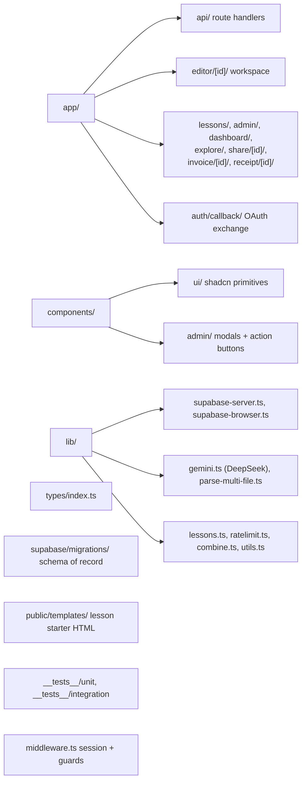

# AGENTS.md

Navigation and conventions for `student-code-builder` — a Next.js 16 App Router app that combines an AI-assisted code editor for students, a structured lesson track, and a teacher/admin back office.

Detailed reference documentation lives in `.agents/summary/`; start with `.agents/summary/index.md`.

## Contents

| Section | What it covers |
| --- | --- |
| [Orientation](#orientation) | The three product surfaces and where each lives |
| [Directory Map](#directory-map) | Layout and the colocation rule |
| [Key Entry Points](#key-entry-points) | The files worth reading first |
| [Patterns That Deviate From Defaults](#patterns-that-deviate-from-defaults) | Repo-specific behavior an agent would otherwise get wrong |
| [Config-Derived Facts](#config-derived-facts) | Things only visible in config files |
| [Security Constraints](#security-constraints) | Non-negotiable rules |
| [Known Issues](#known-issues) | Pre-existing failures, so you don't chase them |
| [Reference Docs](#reference-docs) | Where to go for detail |
| [Custom Instructions](#custom-instructions) | Human-maintained conventions |

## Orientation

<!-- tags: overview, subsystems -->

Three subsystems share one codebase:

1. **Editor** (`app/editor/[id]/`, `components/Editor.tsx` and friends) — a student prompts an LLM, which either tutors them (ask mode) or generates a complete HTML file (build mode); output renders in a sandboxed `srcdoc` iframe.
2. **Lessons** (`app/lessons/`, `lib/lessons.ts`, `public/templates/`) — weekly lessons backed by HTML templates with in-file task anchors and per-task progress.
3. **Admin back office** (`app/admin/`, `app/api/admin/`, `components/admin/`) — student accounts, classes with weekly schedules, and invoices/receipts delivered to parents over Telegram.

## Directory Map

<!-- tags: navigation, structure -->

**Colocation rule:** route-specific client components live beside their route (`app/editor/[id]/EditorLayout.tsx`, `app/admin/classes/ClassesClient.tsx`). Only genuinely reusable UI goes in `components/`. A `page.tsx` next to a `*Client.tsx` is always a server-fetch / client-interact pair.

## Key Entry Points

<!-- tags: navigation, entry-points -->

| Concern | File |
| --- | --- |
| Route guards, admin gate, deactivation check | `middleware.ts` |
| Student workspace | `app/editor/[id]/page.tsx` → `EditorLayout.tsx` |
| LLM pipeline | `app/api/generate/route.ts` |
| Project CRUD | `app/api/projects/route.ts` |
| LLM client + system prompts | `lib/gemini.ts` |
| Supabase clients | `lib/supabase-server.ts`, `lib/supabase-browser.ts` |
| Lesson catalog + versioning | `lib/lessons.ts` |
| Schema of record | `supabase/migrations/` |

## Patterns That Deviate From Defaults

<!-- tags: gotchas, conventions -->

**`lib/gemini.ts` contains no Gemini code.** It holds the DeepSeek client (`https://api.deepseek.com`, `MODEL = "deepseek-v4-flash"`) plus `ASK_SYSTEM_PROMPT` and `BUILD_SYSTEM_PROMPT`. The model constant is pinned for cost control; do not change providers or models without approval. `/api/generate` also logs stream failures as `'OpenRouter stream error:'`, a second stale provider name.

**Three Supabase clients with different privileges.** `createBrowserSupabaseClient()` (anon, Client Components), `createServerSupabaseClient()` (anon + cookies, used to identify the caller, respects RLS), and `supabaseAdmin` (service role, **bypasses RLS**, used for essentially all reads and writes). Because `supabaseAdmin` ignores RLS, authorization must be written into every query — the codebase does this by filtering inside the statement, e.g. `.eq('id', id).eq('user_id', user.id)`, so an owner mismatch yields zero rows instead of a cross-tenant write. Never import `supabaseAdmin` from a Client Component.

**Homework is verified, gated, and reviewed.** Each lesson carries 2–3 `type: 'homework'` tasks plus a `homeworkBrief`. They are hidden in the task panel until every core task is done, live in their own section (never the main list), and hold back build mode exactly like core tasks — `pendingCoreTask()` gates on `['core', 'homework']`. `POST /api/projects/[id]/submit` sets `projects.submission_status` to `'submitted'` and refuses with 409 unless `homeworkComplete()` agrees, so the client cannot hand in unfinished work. Teachers review at `/admin/homework` via `POST /api/admin/homework/[id]/review`, which writes `approved` or `needs_work` and inserts the feedback as a `messages` row with `role: 'teacher'`; feedback is mandatory when sending work back. `needs_work` lets the student hand in again. Teacher messages render as their own bubble in the chat and are relayed to the LLM as `My teacher said: …` because the model API rejects a `teacher` role.

**Build mode is server-authoritative, and lessons withhold it.** The client may send `mode: 'build'`, but `/api/generate` grants it only if `user_build_mode.enabled` is true for that user **and** `pendingCoreTask()` returns null — i.e. every core and homework task of that project's lesson is already complete. While one is open, the request is downgraded to ask mode and `buildTaskNudge()` is appended to the system prompt forbidding the model from writing code. The response carries `X-Effective-Mode` and `X-Open-Task` headers so the client can explain the downgrade instead of looking broken. Only `POST /api/admin/settings` writes the `user_build_mode` flag.

**Lesson tasks are verified, not self-reported.** Each task in `LESSONS` carries `checks: TaskCheck[]` (`lib/task-checks.ts`), evaluated against the student's live file in the browser; `Mark done` stays disabled until they pass. Two invariants are enforced by `__tests__/unit/lib/task-checks.test.ts` and must keep holding: no task may pass on its untouched starter template, and every `textChanged` check must resolve to an element that actually holds the `from` text (a typo'd selector fails the first invariant while permanently trapping a student). Checks fail **open** whenever they cannot run — no DOM, bad regex — because a broken check must never dead-end a child. The escape hatch requires both 90s on task and a hint request. `LEGACY_LESSONS` has no checks and stays self-reported.

**Student-facing lesson copy has a word budget.** `__tests__/unit/lib/lesson-copy.test.ts` caps chips at 5 words, goals at 8, check labels at 6, hints at 10, bans vocabulary above roughly a 9-year-old ESL reading level, and caps total reading load. The audience is 8–13 reading English as a second language; long or advanced copy turns a lesson gate into a reading test.

**The editor autosaves; there is no Save button in lesson projects.** `CodeEditor` reports typing upward after 300ms (driving the preview and the checks), and `EditorLayout` writes to `/api/projects` after 1200ms idle, coalesced through `pendingFilesRef` with an in-flight guard. `CodeEditor` must keep adopting external `code` changes while ignoring the echo of its own emissions (`lastEmitted`), or a generation arriving while the editor is mounted in split view will be overwritten. One step of undo is kept in `undoFiles`, discarded as soon as the student types.

**`kidMode` is on for any lesson project** (`kidMode = lesson !== null`). It raises the type scale, collapses the task list to one task at a time, and hides the console until a real error occurs. It is a proxy for "young student", not a real age signal — there is no age or grade field on `student_profiles`.

**The LLM contract is delimiter-based, and full-file.** Build responses must be `--- FILE: <name> ---` … `--- DONE ---` followed by a summary sentence. `lib/parse-multi-file.ts` parses it; `/api/generate` decides a response is code with `trimStart().startsWith('--- FILE:')`; `parseSummary()`'s text is what gets stored as the assistant chat message. Files are replaced wholesale — there is no diff or patch format. Changing the delimiters means changing the prompt, the parser, and the classification check together.

**Preview is `srcdoc` only.** `components/Preview.tsx` renders `<iframe srcDoc sandbox="allow-scripts allow-forms">`. Do not add WebContainer, Sandpack, or CodeSandbox — the absence of an external sandbox is intentional. A console-interceptor script is injected after `<head>` and forwards `console.*` and errors to the parent via `postMessage({ type: '__console__' })`; it also shims `localStorage`/`sessionStorage`, unavailable in the opaque-origin frame. `lib/combine.ts` inlines `style.css` and `script.js` by exact filename and strips external `<link>`/`<script src>` tags before rendering.

**Admin API routes re-verify authorization themselves.** Middleware only guards page navigation under `/admin`. Every admin route file defines its own local `isAdmin(email)` against `ADMIN_EMAILS`. A new admin endpoint without that check is unprotected.

**Middleware treats a missing `student_profiles` row as "not a student" and allows it through.** Only an explicit `is_active === false` redirects to `/login?reason=deactivated`.

**Rate limiting fails open and uses `prompts` as its ledger.** `lib/ratelimit.ts` counts rows in the last hour against a limit of 20; a failed count query allows the request. Admins bypass it entirely. Deleting prompt rows resets a user's quota.

**Lesson versioning uses parallel catalogs, not migrations.** `getLessonForProject` reads the current catalog only when a project's `lesson_version` equals `CURRENT_LESSON_VERSION`, else the legacy catalog. Old projects keep their original task ids because `lesson_progress.completed_task_ids` stores those ids as plain strings. Bump the version by adding a catalog, never by editing the old one.

**Lesson tasks bind to code by string match.** Each task's `commentAnchor` is searched for in the file text to drive editor highlighting. Renaming an anchor comment in `public/templates/*.html` silently breaks it.

**Component tests need a jsdom docblock.** `jest.config.ts` sets `testEnvironment: 'node'` globally, so every `.tsx` test starts with `/** @jest-environment jsdom */`.

## Config-Derived Facts

<!-- tags: config, tooling -->

- `@/` maps to the repository root, declared in both `tsconfig.json` (`paths`) and `jest.config.ts` (`moduleNameMapper`); keep them in sync.
- Middleware matcher excludes `_next/static`, `_next/image`, `favicon.ico`, `auth/callback`, and `share` — the last two deliberately, so OAuth can complete without a session and share pages stay public.
- `next.config.js` sets only `turbopack.root` (pinned because an unrelated `package-lock.json` in a parent directory made Turbopack infer the wrong workspace root).
- Next.js 16 + React 19. `params` in every page and route handler is a `Promise` and must be awaited, and `createServerSupabaseClient()` is **async** because `cookies()` is — always `await` it.
- Linting is ESLint flat config (`eslint.config.mjs`) running `@next/eslint-plugin-next` recommended + core-web-vitals, plus `react-hooks/rules-of-hooks` and `exhaustive-deps`. `next lint` no longer exists; the script is `eslint .`. The react-hooks plugin's current `recommended` set adds React Compiler rules that flag long-standing patterns here, so it is deliberately not enabled.
- `components.json` configures shadcn (style `base-nova`, `lucide` icons, RSC on).
- No CI workflow, git hooks, or deployment config exist in the repository.
- Environment variables: `NEXT_PUBLIC_SUPABASE_URL`, `NEXT_PUBLIC_SUPABASE_ANON_KEY`, and `NEXT_PUBLIC_SITE_URL` reach the browser. `SUPABASE_SERVICE_ROLE_KEY`, `DEEPSEEK_API_KEY`, `TELEGRAM_BOT_TOKEN`, and `ADMIN_EMAILS` are server-only. `ADMIN_EMAILS` is comma-separated and grants both back-office access and an unlimited prompt quota.

## Security Constraints

<!-- tags: security -->

- Never expose `SUPABASE_SERVICE_ROLE_KEY`, `DEEPSEEK_API_KEY`, or `TELEGRAM_BOT_TOKEN` to the browser; only `NEXT_PUBLIC_*` values may be referenced from `'use client'` files.
- All writes go through server route handlers using `supabaseAdmin`, never from the browser.
- Because `supabaseAdmin` bypasses RLS, every query needs its own ownership or admin check.
- The `"Admin full access"` RLS policies are unconditional `using (true)` predicates. They do not identify an admin and are not a security boundary — enforcement comes from the server routes. Do not expose those tables to the anon key.
- `/invoice/[id]` and `/receipt/[id]` perform no authorization; the id is the only access control.

## Known Issues

<!-- tags: gotchas, testing -->

Pre-existing on a clean checkout, so don't attribute them to your change:

- `bun run test` fails 3 suites / 7 tests because tests encode stale values: a rate limit of 10 (code uses 20), a default project title of `"Untitled"` (code generates a random name), and a request field named `currentCode` (code uses `selectedCode`).
- `bun run test:unit` and `bun run test:integration` find nothing — they pass `--selectProjects` but `jest.config.ts` defines no `projects`. Use `bun run test` or a path filter.
- `types/index.ts` has no interfaces for `app_settings` or `user_build_mode`.
- `bun run lint` reports 10 pre-existing `no-html-link-for-pages` errors (`components/Navbar.tsx`, `components/Footer.tsx`, `app/share/[id]/page.tsx`, `app/about/page.tsx`, `app/dashboard/DashboardClient.tsx` use `<a>` where `<Link>` belongs) and one `no-page-custom-font` warning in `app/layout.tsx`. These predate the Next 16 upgrade; they were invisible because `next lint` had no config and only ever opened its interactive setup prompt.
- `middleware.ts` still works but the filename is deprecated in Next 16 in favour of `proxy.ts`. It was left as-is: `proxy` forces the Node runtime, and renaming it is a behavioural change worth doing on its own.
- `CLAUDE.md` describes an earlier MVP scope (claims no multi-file and no payments) that the code has outgrown.

Full detail and prioritized fixes: `.agents/summary/review_notes.md`.

## Reference Docs

<!-- tags: documentation -->

| Document | Use for |
| --- | --- |
| `.agents/summary/index.md` | Knowledge-base entry point and question routing |
| `.agents/summary/codebase_info.md` | Stack, directory hierarchy, config inventory |
| `.agents/summary/architecture.md` | Layers, Supabase boundaries, middleware and generation pipelines |
| `.agents/summary/components.md` | Which file owns which piece of UI |
| `.agents/summary/interfaces.md` | Every endpoint's contract and status codes |
| `.agents/summary/data_models.md` | Schema, RLS, cascades, type mapping |
| `.agents/summary/workflows.md` | End-to-end user journeys |
| `.agents/summary/dependencies.md` | Packages, external services, environment variables |
| `.agents/summary/review_notes.md` | Known issues and security observations |

## Custom Instructions

<!-- This section is for human and agent-maintained operational knowledge.
     Add repo-specific conventions, gotchas, and workflow rules here.
     This section is preserved exactly as-is when re-running codebase-summary. -->

### Project Structure & Module Organization

This is a Next.js 14 App Router application. Route pages, layouts, and API handlers live in `app/`; keep route-specific client components beside their route (for example, `app/editor/[id]/EditorLayout.tsx`). Reusable UI belongs in `components/`, with primitives in `components/ui/`. Shared utilities live in `lib/`, and shared TypeScript types in `types/`.

Tests mirror the implementation area under `__tests__/unit/` and `__tests__/integration/`. Put Supabase schema changes in `supabase/migrations/` using dated, descriptive SQL filenames such as `20260329_cascade_user_deletes.sql`. Static templates and assets belong in `public/`.

### Build, Test, and Development Commands

- `bun run dev` starts the local Next.js development server.
- `bun run build` creates a production build; run it before submitting changes that affect routes or configuration.
- `bun run start` serves a completed production build.
- `bun run test` runs the Jest suite.
- `bunx jest __tests__/unit/lib/ratelimit.test.ts` runs one focused test file.
- `bun run lint` runs the configured Next.js ESLint command.

Use `bun` for reproducible installs because the repository includes `bun.lock`. Scripts must be invoked as `bun run <script>` — `bun test` runs bun's own built-in test runner, not Jest, and will not run this suite.

### Coding Style & Naming Conventions

Write TypeScript with the existing style: two-space indentation, single quotes, omitted semicolons, and strict types. Prefer the `@/` alias for root imports. Name React components in PascalCase (`ProfileDropdown.tsx`), utilities in camelCase (`parse-multi-file.ts`), and route handlers `route.ts`. Keep Client Components explicit with `'use client'`; do not move server-only logic into them.

Tailwind CSS is the styling system. Reuse `cn()` from `lib/utils.ts` for conditional class names and existing `components/ui` primitives before adding duplicate UI patterns.

### Testing Guidelines

Jest is configured through `jest.config.ts` with Testing Library support. Name tests `*.test.ts` or `*.test.tsx` and place them under the matching `__tests__/unit/` or `__tests__/integration/` area. Test observable behavior, mock external Supabase/LLM dependencies, and cover error paths for API and persistence logic. Run relevant focused tests during development, then `bun run test` before opening a pull request.

### Commit & Pull Request Guidelines

Follow the history's concise imperative style, preferably Conventional Commits: `feat(admin): add class schedule editor`, `fix: enforce rate limit`, or `refactor: simplify editor state`. Keep each commit focused. Pull requests should explain the user-facing change, note migrations or environment-variable changes, link the related issue when available, and include screenshots for visible UI changes.

### Security & Configuration

Keep `SUPABASE_SERVICE_ROLE_KEY` and `DEEPSEEK_API_KEY` server-only; only `NEXT_PUBLIC_*` values may reach the browser. Use the Supabase server/admin clients only from server code, preserve RLS expectations, and never commit local environment files or secrets.

<!-- BEGIN:nextjs-agent-rules -->

# This is NOT the Next.js you know

This version has breaking changes — APIs, conventions, and file structure may all differ from your training data. Read the relevant guide in `node_modules/next/dist/docs/` (resolved from this file's directory; in monorepos the `next` package may not be visible from the repo root) before writing any code. Heed deprecation notices.

This block is written and re-added by `next dev` — verify at `node_modules/next/dist/server/lib/generate-agent-files.js`. Removing it from a diff only re-creates the uncommitted change; committing it with your work keeps the tree clean.

<!-- END:nextjs-agent-rules -->
