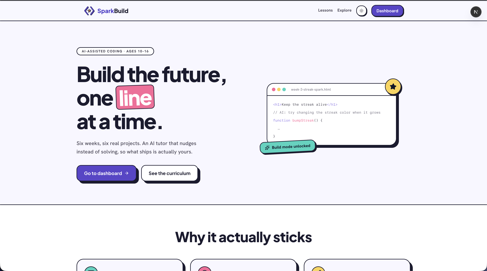
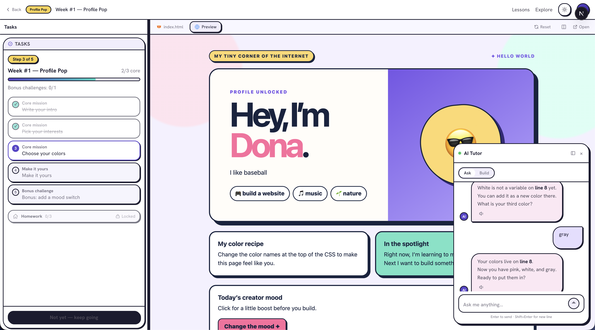

# SparkBuild — Student Code Builder

**Build the future, one line at a time.**

SparkBuild is an AI-assisted coding platform for students aged 10–16. Over a 6-week guided track, students build real, shippable projects — personal profile pages, interactive games, data-driven tools — by prompting an LLM that nudges instead of solving, so what ships is actually theirs. Teachers run classes, review homework, and communicate with parents; admins manage invoices and receipts over Telegram — all through one back office.

## Screenshots

| Landing page | Guided lesson workspace |
| --- | --- |
|  |  |

The landing page introduces the pitch and curriculum. The workspace pairs a step-by-step task checklist with a live preview and an AI tutor that asks guiding questions ("Your colors live on line 8 — ready to put them in?") rather than handing over the answer.

## Features

**Student Editor** — prompt-driven workspace where students type what they want to build and see a live HTML preview in a sandboxed iframe. Two modes: *ask* (the AI tutors) and *build* (the AI generates code). Build mode is server-gated behind task completion.

**Guided Lessons** — 6 weekly lessons with structured tasks, bonus/mood-boost challenges, automated code checks, and homework. Task verification is code-aware (checks run against the student's live file), so progress can't be self-reported past the system. Copy is capped to an 8–13-year-old ESL reading level.

**AI Tutor Chat** — a persistent, context-aware chat panel that answers questions about the student's own code (variable names, line numbers, next steps) without writing it for them in ask mode.

**Admin Back Office** — manage students, classes with weekly schedules, invoices/receipts delivered over Telegram, homework review with mandatory feedback, and per-student build-mode control.

## Tech Stack

| Layer | Technology |
| --- | --- |
| Framework | Next.js 16 (App Router) + React 19 |
| Language | TypeScript |
| Styling | Tailwind CSS 3 |
| UI Components | shadcn/ui (base-nova style) |
| Editor | CodeMirror 6 |
| Auth & Database | Supabase (Auth + Postgres + RLS) |
| AI | DeepSeek v4-flash via OpenAI SDK |
| Testing | Jest 30 + Testing Library |
| Linting | ESLint 9 (flat config) |

## Getting Started

### Prerequisites

- Node.js 20+
- [bun](https://bun.sh)
- A Supabase project
- A DeepSeek API key

### Installation

```bash
git clone https://github.com/thymadona/Sparkbuild-AI-agent.git
cd Sparkbuild-AI-agent
bun install
```

### Environment Variables

Copy the example file and fill in your values:

```bash
cp .env.local.example .env.local
```

| Variable | Scope | Description |
| --- | --- | --- |
| `NEXT_PUBLIC_SUPABASE_URL` | Client + Server | Supabase project URL |
| `NEXT_PUBLIC_SUPABASE_ANON_KEY` | Client + Server | Supabase anon/public key |
| `NEXT_PUBLIC_SITE_URL` | Client + Server | Your deployment URL |
| `SUPABASE_SERVICE_ROLE_KEY` | Server only | Supabase service role key (bypasses RLS) |
| `DATABASE_URL` | Server only | Postgres pooler URL for Drizzle (bypasses RLS like the service role) |
| `DEEPSEEK_API_KEY` | Server only | DeepSeek API key |
| `TELEGRAM_BOT_TOKEN` | Server only | Telegram bot token for invoice delivery |
| `UPSTASH_REDIS_REST_URL` | Server only | Backs rate limiting and read caching |
| `UPSTASH_REDIS_REST_TOKEN` | Server only | Backs rate limiting and read caching |

### Database Setup

Schema is Drizzle-native (`lib/db/schema.ts` → `./drizzle`). Apply the full migration history against `DATABASE_URL`:

```bash
bun run db:migrate
```

To change the schema afterward: edit `lib/db/schema.ts`, run `bun run db:generate` to derive DDL, then `bun run db:migrate` again. See `drizzle/README.md`.

### Development

```bash
bun run dev
```

The app starts at `http://localhost:3000`. Authenticated users are redirected to `/dashboard`; unauthenticated users land on `/login`.

### Production Build

```bash
bun run build
bun run start
```

## Project Structure

```
app/
├── api/              Route handlers (generate, projects, admin, settings)
├── editor/[id]/      Student workspace (server page + EditorLayout client)
├── lessons/          Lesson catalog and individual lesson pages
├── admin/            Back office (students, classes, finance, homework, telegram)
├── dashboard/        Student project list
├── explore/          Public project gallery
├── share/[id]/       Public share page (no auth required)
├── invoice/[id]/     Invoice view (link-based access)
├── receipt/[id]/     Receipt view (link-based access)
├── auth/callback/    OAuth callback
└── login/, register/, about/, profile/

components/
├── ui/               shadcn primitives (Button, DropdownMenu)
├── admin/            Admin modals and action buttons
├── Editor.tsx        Main editor orchestration
├── CodeEditor.tsx    CodeMirror wrapper
├── Preview.tsx       Sandboxed iframe preview
├── Navigator.tsx     Lesson task panel
└── ...

lib/
├── supabase-server.ts   Server client (anon + cookies) & admin client (service role)
├── supabase-browser.ts  Browser client (anon)
├── gemini.ts            DeepSeek client + system prompts
├── lessons.ts           Lesson catalog with task definitions
├── task-checks.ts       Automated task verification logic
├── task-guard.ts        Build-mode gating (pendingCoreTask)
├── parse-multi-file.ts  LLM response delimiter parser
├── combine.ts           HTML/CSS/JS inliner for preview
├── ratelimit.ts         Per-user prompt rate limiting
├── schedule.ts          Class scheduling utilities
└── utils.ts             cn() and shared helpers

types/index.ts           Shared TypeScript interfaces
lib/db/schema.ts         Drizzle schema — authoring entry point
drizzle/                 Schema of record (applied SQL migrations)
public/templates/        Lesson starter HTML files
__tests__/               Unit and integration tests
middleware.ts            Session refresh, route guards, admin gate
```

## Scripts

| Command | Description |
| --- | --- |
| `bun run dev` | Start development server (Turbopack) |
| `bun run build` | Production build |
| `bun run start` | Serve production build |
| `bun run test` | Run all Jest tests |
| `bun run lint` | Run ESLint |
| `bun run db:generate` | Derive migration DDL from `lib/db/schema.ts` into `./drizzle` |
| `bun run db:migrate` | Apply pending `./drizzle` migrations to `DATABASE_URL` |
| `bun run db:studio` | Open Drizzle Studio against the live DB |

Run a single test file:

```bash
bunx jest __tests__/unit/lib/ratelimit.test.ts
```

## Architecture Notes

- **Auth**: Supabase Auth with OAuth. Middleware refreshes sessions and guards `/dashboard`, `/editor`, `/profile`, and `/admin` routes.
- **Admin access**: Role-based via `public.user_roles` / `public.role_permissions`, checked per-route with `hasPermission()`. Each admin API route re-verifies authorization independently — middleware only guards page navigation.
- **LLM pipeline**: `POST /api/generate` streams responses from DeepSeek. Build-mode responses use a `--- FILE: name ---` / `--- DONE ---` delimiter format parsed by `lib/parse-multi-file.ts`.
- **Preview**: Pure `srcdoc` iframe with `sandbox="allow-scripts allow-forms"`. No external sandbox runtime. A console interceptor script is injected for error reporting.
- **Autosave**: The editor writes to `/api/projects` after 1200ms of idle time. No manual save button for lesson projects.
- **Rate limiting**: 50 prompts per hour per user via Upstash Redis (sliding window). Fails open on Redis errors. Admins and teachers bypass.
- **Lesson versioning**: Parallel catalogs, not migrations. Old projects keep their task IDs intact.

## Testing

Tests live in `__tests__/unit/` and `__tests__/integration/`, mirroring the source tree. Component tests that need a DOM require a jsdom docblock:

```ts
/** @jest-environment jsdom */
```

The default test environment is Node.

## License

Private — not licensed for redistribution.
