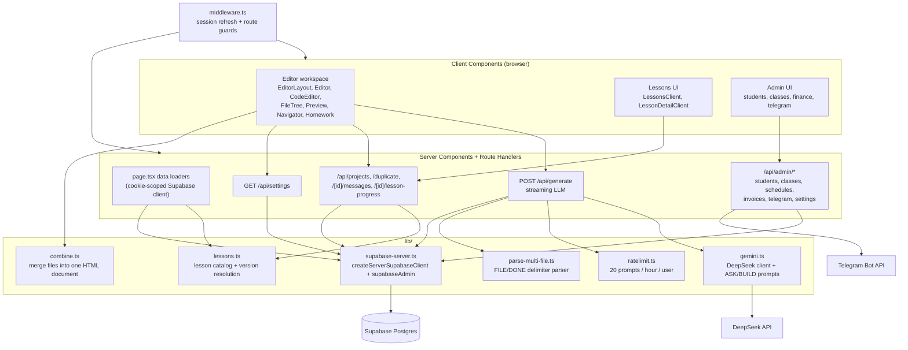
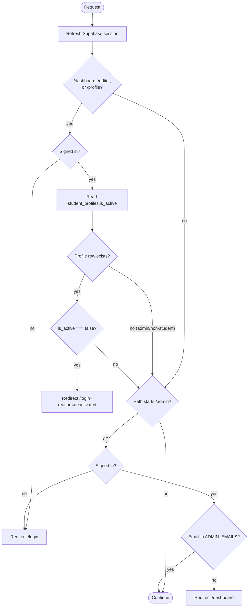
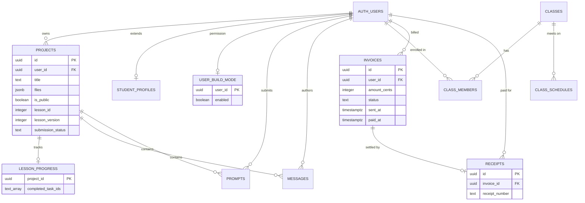
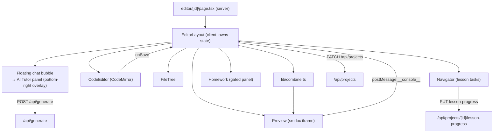
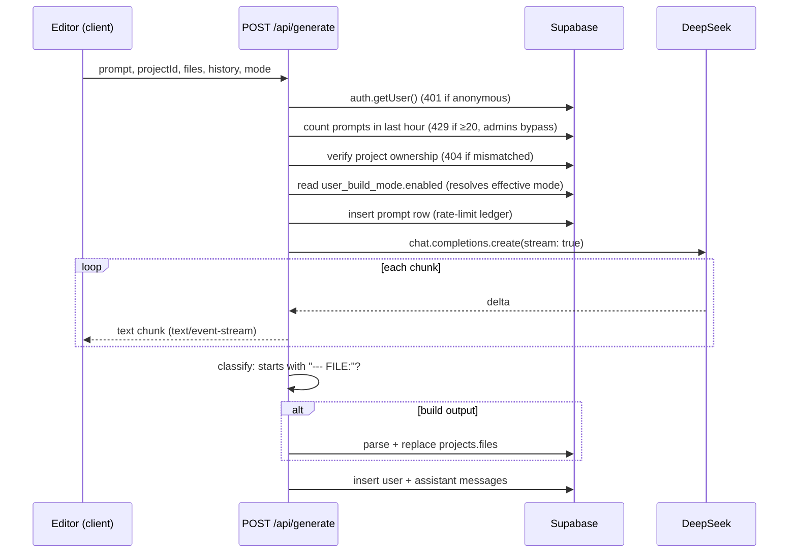
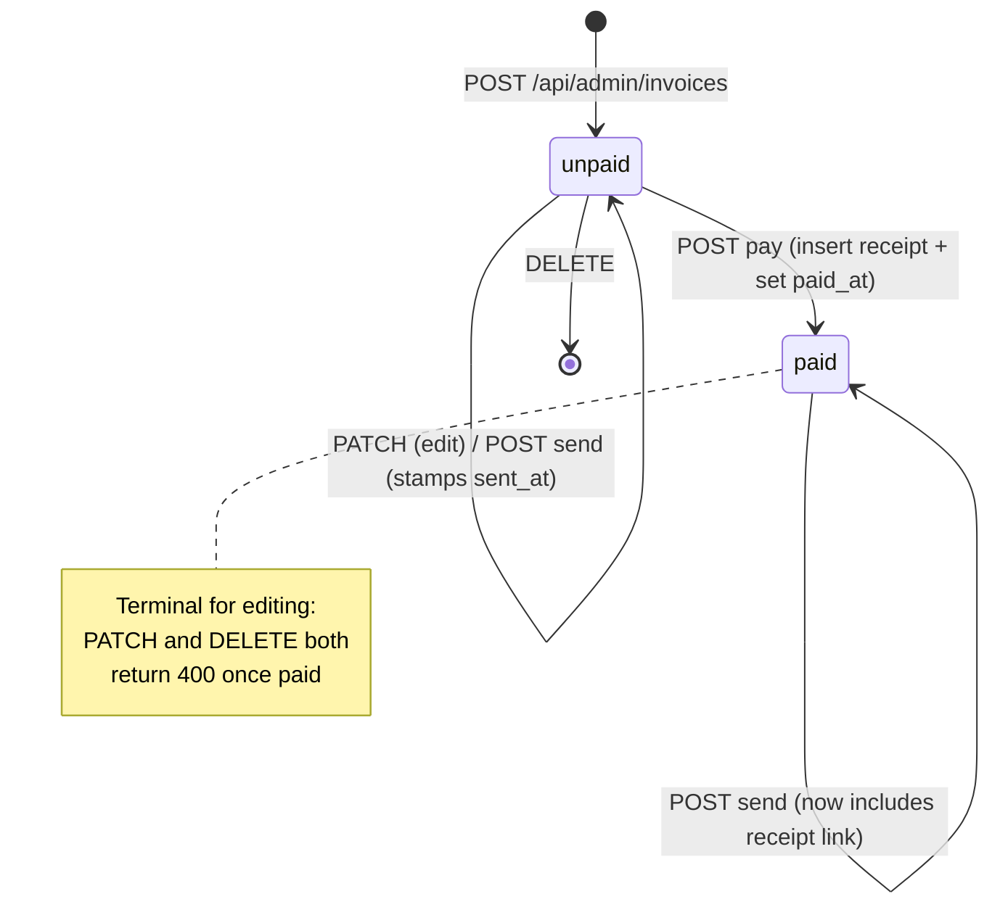
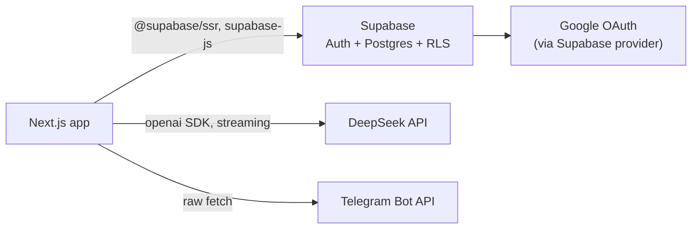

# System Design — Student Code Builder

An AI-assisted coding platform for students aged 10–16. Students work through a 6-week lesson
track, prompting an LLM that either tutors (ask mode) or generates a complete HTML/CSS/JS file
(build mode), rendered live in a sandboxed iframe. Teachers and admins run classes, review
homework, and manage invoices/receipts (delivered over Telegram) through a back office.

This document is the high-level design; `CLAUDE.md` covers day-to-day commands and
codebase-specific conventions.

## 1. Goals and Non-Goals

**Goals**
- Let a 10–16 year old go from "click a lesson" to "see working code run" in minutes, with an
  AI tutor that nudges rather than solves.
- Keep the preview sandbox dependency-free — no WebContainer, Sandpack, or CodeSandbox SDK.
- Give teachers/admins a back office for rosters, homework review, and Telegram-delivered
  invoicing, without a separate app or database.
- Control LLM cost deterministically: one pinned model, a hard per-user hourly cap, and a
  server-enforced gate on code-generation (build mode).

**Non-goals**
- Real-time multiplayer/collaborative editing.
- Arbitrary language/runtime support — the platform is HTML/CSS/JS only, rendered client-side.
- A generic LMS — lessons are a fixed, versioned catalog in code, not admin-authored content.

## 2. Tech Stack

| Layer | Choice |
| --- | --- |
| Framework | Next.js 16 (App Router), React 19 |
| Language | TypeScript |
| Styling | Tailwind CSS, `class-variance-authority`, shadcn-generated primitives on `@base-ui/react` |
| Auth + DB | Supabase (Postgres + Auth + RLS), Google OAuth as the only sign-in method |
| DB access | `supabaseAdmin` (service-role, bypasses RLS) for nearly all reads/writes; Drizzle (`lib/db/client.ts`, `lib/db/schema.ts`) available as a typed, additive alternative on the same connection — see §5 |
| LLM | DeepSeek API via the `openai` SDK, model pinned to `deepseek-v4-flash` (`lib/gemini.ts`) |
| Code editor | CodeMirror (`@uiw/react-codemirror`) |
| Preview | Sandboxed `<iframe srcDoc>`, zero external sandbox infra |
| Messaging | Telegram Bot API (raw `fetch`) for invoice/receipt delivery |
| Tests | Jest + Testing Library |
| Package manager | `bun` (`bun.lock` is authoritative; run scripts as `bun run <script>`) |

Deliberately absent: state-management library, data-fetching library, form library, ORM as the
primary access path (the Supabase query builder is used directly; Drizzle is additive, not a
replacement), and any browser-sandbox package.

## 3. High-Level Architecture

**Pattern used on every route**: `page.tsx` is a Server Component — it authenticates via
cookies, fetches what the page needs, and hands it as props to a colocated `'use client'`
component (`*Client.tsx` / `*Layout.tsx`) that owns interaction state and mutates data only
through `fetch` calls to route handlers, never directly against Postgres.

## 4. Trust Boundaries

### 4.1 Three Supabase clients

| Client | Key | Runs where | RLS |
| --- | --- | --- | --- |
| `createBrowserSupabaseClient()` | anon | Client Components | enforced |
| `createServerSupabaseClient()` | anon + request cookies | Server Components, route handlers | enforced |
| `supabaseAdmin` | service role | server only | **bypassed** |

`createServerSupabaseClient()` answers one question — *who is this request?* The actual reads
and writes go through `supabaseAdmin`, which means **every query must carry its own ownership
check** (`.eq('id', id).eq('user_id', user.id)`), since RLS isn't there to catch a mismatch. A
foreign id therefore fails as "not found," not as a silent cross-tenant write.
`supabaseAdmin` must never be imported into a Client Component, and the browser client is used
only for `signInWithOAuth` / `signOut` / reading the current user.

### 4.2 Middleware pipeline

Two consequences worth internalizing:
- **A missing `student_profiles` row means "not a student" and is allowed through.** Only an
  explicit `is_active === false` blocks access.
- **Middleware only protects page navigation, not API authorization.** Every admin route
  handler independently re-checks `ADMIN_EMAILS` via a locally defined `isAdmin(email)` — there
  is no shared helper, so a new admin endpoint must add this check itself.

### 4.3 RLS posture

RLS is enabled on most tables, but because the primary access path (`supabaseAdmin`) bypasses
it, RLS is a defense-in-depth backstop, not the authorization boundary. Notably, `classes`,
`class_members`, `class_schedules`, `invoices`, `receipts`, and `student_profiles` carry
"admin full access" policies that are unconditional `using (true)` — they do not identify an
admin. Effective authorization for those tables comes entirely from routes funneling through
`ADMIN_EMAILS` checks. `lesson_progress` has RLS enabled with **no policies**, making it
unreachable except through the service-role client. Do not expose these tables to the anon key
and do not treat the "admin" policies as real access control.

## 5. Data Model

`lib/db/schema.ts` is the authoring entry point and `./drizzle` (applied via `bun run
db:migrate`) is the schema of record; `types/index.ts` is a separate hand-maintained mirror
with no generator, so the two can drift. `drizzle-kit
pull`/`push` are permanently unusable against this schema — an upstream bug misclassifies
foreign keys during introspection — so `bun run db:generate` (diffs `schema.ts` against a local
snapshot, no DB connection) is the only path from schema change to applied migration. See
`drizzle/README.md`.

Field semantics worth knowing:
- **`projects.files`** — flat `{ filename: contents }` JSONB. `index.html` is the assumed
  entry point; `lib/combine.ts` additionally inlines `style.css` and `script.js` by exact name.
- **`projects.lesson_id` / `lesson_version`** — `null` means a free-form project. Resolution
  reads the *current* lesson catalog only when `lesson_version === CURRENT_LESSON_VERSION`,
  otherwise the legacy catalog — this keeps old projects' `lesson_progress.completed_task_ids`
  (plain strings, no FK) valid against task ids that no longer exist in the current catalog.
- **`prompts`** doubles as the rate-limit ledger — `lib/ratelimit.ts` counts a user's rows in
  the last hour against a cap of 20.
- **Money** is always integer cents; `receipts` are an immutable snapshot copied at payment
  time so later invoice edits can't rewrite history.
- **Cascades**: deleting an `auth.users` row cascades to `projects`, `prompts`,
  `student_profiles`, `user_build_mode`, `class_members`, `messages`, `invoices`.
  `receipts` intentionally has **no** cascade.

## 6. Core Subsystems

### 6.1 Editor (`app/editor/[id]/`, `components/Editor.tsx`, `components/Preview.tsx`)

`EditorLayout` is a single client component owning all workspace state: the file map,
open tabs, active file, chat messages, panel sizes, the left activity sidebar, the console log
buffer, and the highlighted line for lesson tasks.

- **Sidebar** (activity bar + panel) switches between `explorer` (file tree), `navigator`
  (lesson tasks), and `homework` (gated homework panel) — one at a time, resizable by drag.
- **Chat is a floating panel, not a sidebar tab.** A round bubble button (bottom-right of the
  preview/code column) opens an "AI Tutor" panel that overlays that column without covering the
  sidebar, so a lesson's task list stays visible while the student is chatting. The panel stays
  mounted at all times (visibility/opacity/scale toggled, not unmounted) so an in-flight
  generation and a pending task-triggered prompt survive open/close, and open/close animates
  via CSS transition rather than snapping.
- **Preview** is `srcdoc`-only by design. `Preview.tsx` injects a console-interceptor script
  that forwards `console.*` and `window.onerror` to the parent via `postMessage`, which
  `EditorLayout` uses to populate the Console tab; it also shims `localStorage`/`sessionStorage`
  (unavailable in a sandboxed opaque-origin frame). Output not starting with
  `<!DOCTYPE html>` renders an "Invalid output" panel instead of the iframe.
- **Build mode is server-gated**: offered to the student only if `user_build_mode.enabled` is
  true *and* the project has no pending core/homework task — an admin control
  (`BuildModeToggle`), not something the student can flip.
- **Saving is explicit, not autosaved** in the sense that every keystroke debounces into a full
  `files` map write via `PATCH /api/projects` — there's no separate diff/patch path.

### 6.2 Generation pipeline (`POST /api/generate`)

The most involved path in the system — streaming, rate-limited, and mode-gated.

Design notes:
- **Rate limiting fails open** — a counting-query error allows the request; availability was
  chosen over strict enforcement.
- **Full-file replacement, no diffs** — the model always returns complete files.
- **The two modes are enforced by prompt, not by request payload**: ask mode (default) never
  writes code and always ends with a short question; build mode returns one complete HTML file
  in a strict `--- FILE: ... --- DONE ---` delimiter format, parsed by
  `lib/parse-multi-file.ts`. Since build mode additionally requires the server-side
  `user_build_mode.enabled` flag, a student cannot escalate to code generation by editing the
  client request.
- Persistence happens *inside* the stream controller, after the stream closes, so a client that
  disconnects mid-stream still gets its files and messages saved.

### 6.3 Lessons (`app/lessons/`, `lib/lessons.ts`, `public/templates/`)

`lib/lessons.ts` holds two parallel catalogs plus a resolver
(`getLessonForProject(lessonId, lessonVersion)`), selected by `CURRENT_LESSON_VERSION`. A
project's `lesson_id`/`lesson_version` are stamped at creation and never rewritten to a newer
version by the API, so **a lesson revision is a new catalog, not an edit to the old one** — this
is what keeps `lesson_progress.completed_task_ids` (plain string ids, no FK) valid over time.

Task-to-code linkage is by string search: each task carries a `commentAnchor`, and `Navigator`
finds the line containing that anchor to drive editor highlighting — renaming an anchor comment
in a template silently breaks highlighting for that task. Task ordering isn't strictly
sequential: the active task is the first incomplete `core` task, falling back to `choice`/
`bonus`. Progress writes are optimistic with rollback on a failed `PUT`.

### 6.4 Admin back office (`app/admin/`, `app/api/admin/`, `components/admin/`)

Students, classes/schedules, homework review, and invoices/receipts. Every admin page is
guarded by middleware for navigation, and every admin API route independently re-checks
`ADMIN_EMAILS` (`isAdmin(email)`, duplicated per file rather than shared). Money is formatted
at the point of display by several independent local `formatAmount` helpers — there is no
shared currency utility.

**Invoice lifecycle**:

Sending pushes a Markdown message to the parent's Telegram chat (requires
`parent_telegram_chat_id` on the student's profile); marking paid allocates a receipt number
from a Postgres sequence and inserts an immutable snapshot **before** flipping the invoice to
`paid` — these are two separate statements with no transaction, so a failure between them can
leave an orphaned receipt on a still-`unpaid` invoice. `/invoice/[id]` and `/receipt/[id]` are
intentionally outside the middleware's protected prefixes (print-friendly, link-shared pages);
the id itself is the only access control on them.

## 7. External Services & Configuration

| Variable | Exposure | Purpose |
| --- | --- | --- |
| `NEXT_PUBLIC_SUPABASE_URL` / `NEXT_PUBLIC_SUPABASE_ANON_KEY` | browser + server | Supabase clients |
| `SUPABASE_SERVICE_ROLE_KEY` | server only | `supabaseAdmin` (bypasses RLS) |
| `DATABASE_URL` | server only | Drizzle's Postgres pooler connection (same privilege as `supabaseAdmin`) |
| `DEEPSEEK_API_KEY` | server only | LLM calls |
| `ADMIN_EMAILS` | server only | back-office gate + rate-limit bypass — authorization config, not a feature flag |
| `TELEGRAM_BOT_TOKEN` | server only | invoice send / chat-id discovery |
| `NEXT_PUBLIC_SITE_URL` | browser + server | absolute links in Telegram messages (defaults to `''`, silently relative if unset) |

The LLM model is a pinned constant (`deepseek-v4-flash`) for cost control, alongside the
per-user hourly prompt cap — changing providers/models requires explicit approval per
`CLAUDE.md`.

## 8. Known Tradeoffs and Limitations

- **`supabaseAdmin` bypasses RLS everywhere it's used**, which is most of the app. Correctness
  depends entirely on every query remembering its own ownership filter — there's no structural
  backstop if one is omitted.
- **Rate limiting fails open** on query error, favoring availability over strict enforcement.
- **`types/index.ts` is hand-maintained**, not generated, and can drift from the migrations
  that are the actual schema of record.
- **No transaction wraps the receipt-then-invoice-paid write**, leaving a narrow window for an
  orphaned receipt.
- **`postMessage` from the preview iframe doesn't check `event.origin`**, acceptable only
  because the frame always contains the student's own project.
- **Lesson task-to-code linkage is a string match** against a comment anchor, with no guardrail
  if a template's anchor text is edited.

## 9. Where to Go Deeper

Commands, environment variables, and day-to-day conventions live in `CLAUDE.md`.
